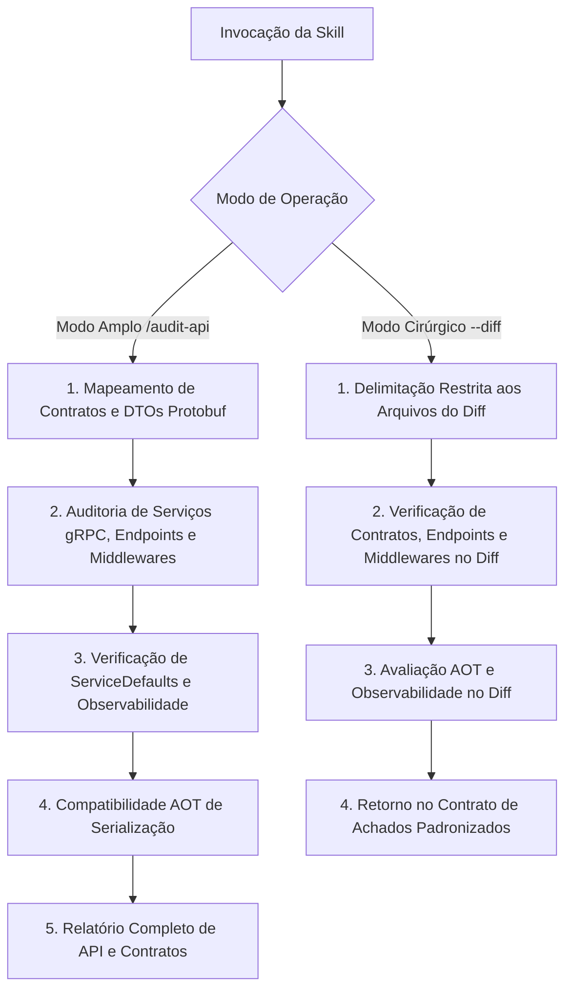

# Auditoria de API e Contratos gRPC (Audit API)

Runbook operacional especializado para auditar a superfície de comunicação backend, contratos e transporte da solução: contratos gRPC Code-First, interfaces de serviço, contratos de dados imutáveis com Protobuf, serialização, serviços e endpoints gRPC/REST, Minimal APIs, interceptadores, middlewares e observabilidade de serviços.

---

## Modos de Operação Transparentes

A skill opera em dois modos distintos de execução:

### 1. Modo Amplo (Full Audit)
Invocação manual para análise da superfície de contratos, APIs e observabilidade da solução completa ou de um módulo específico:
```bash
/audit-api
/audit-api [caminho_ou_camada]
```
- Produz o relatório analítico completo de conformidade de APIs e contratos.

### 2. Modo Cirúrgico / Focado (Scoped Audit)
Invocação com escopo restrito aos arquivos alterados no diff (utilizado primordialmente pelo orquestrador de `code-review` via subagente):
```bash
/audit-api --diff
/audit-api --diff [lista_de_arquivos]
```
- Analisa exclusivamente as alterações do diff com isolamento de contexto e retorna os achados estritamente dentro do **Contrato de Achados Padronizados**.

---

## Regras de Governança Aplicáveis

A avaliação de contratos, APIs e transporte é regida integralmente pelas regras documentadas em [.agents/rules/](../../rules/):

- **Contratos & gRPC**: Seguir integralmente [.agents/rules/contracts-rules.md](../../rules/contracts-rules.md).
- **APIs**: Seguir integralmente [.agents/rules/api-rules.md](../../rules/api-rules.md).
- **ServiceDefaults**: Seguir integralmente [.agents/rules/service-defaults-rules.md](../../rules/service-defaults-rules.md).
- **Convenções C#**: Seguir integralmente [.agents/rules/csharp-conventions.md](../../rules/csharp-conventions.md).

---

## Orquestração de Recursos por Plugin e Origem

A skill `audit-api` orquestra as seguintes ferramentas especializadas:

### Plugin `dotnet-aspnetcore`
- Skill `dotnet-webapi`
- Skill `minimal-api-file-upload`
- Skill `configuring-opentelemetry-dotnet`

### Plugin `dotnet-upgrade`
- Skill `dotnet-aot-compat`

### Plugin `dotnet-data`
- Skill `create-datadriven-aspnetcore`

---

## Fluxo de Execução da Auditoria



---

## Passos de Execução: Modo Amplo (Full Audit)

### Passo 1: Contratos gRPC Code-First e Serialização Protobuf
Avaliar interfaces de serviço, contratos de requisição e resposta, imutabilidade, anotações de serialização e convenções de ordenação conforme as regras de contratos e convenções C#.

### Passo 2: Serviços de API, Endpoints e Middlewares
Auditar serviços gRPC, endpoints REST, mapeamento de rotas, interceptadores e tratamento de exceções em conformidade com as regras de API e as skills `dotnet-webapi`, `minimal-api-file-upload` e `create-datadriven-aspnetcore`.

### Passo 3: ServiceDefaults e Observabilidade
Verificar a instrumentação de métricas, traces, logs distribuídos e resiliência HTTP de acordo com as regras de ServiceDefaults e a skill `configuring-opentelemetry-dotnet`.

### Passo 4: Compatibilidade com Compilação AOT
Avaliar a compatibilidade de serialização e supressão de reflexão em contratos e endpoints utilizando a skill `dotnet-aot-compat`.

---

## Passos de Execução: Modo Cirúrgico / Focado (`--diff`)

Quando invocado via subagente a partir do `code-review` ou diretamente com `--diff`:

1. **Delimitação Cirúrgica**: Filtrar estritamente os arquivos modificados na sessão/diff pertencentes às camadas de contratos, APIs e ServiceDefaults.
2. **Verificação de Contratos e DTOs no Diff**: Analisar interfaces de serviço e contratos alterados, validando tipagem forte, imutabilidade, decorators de serialização e compatibilidade AOT via `dotnet-aot-compat`.
3. **Verificação de Serviços, Endpoints e Middlewares no Diff**: Avaliar novos endpoints, mapeamentos ou middlewares utilizando `dotnet-webapi`, `minimal-api-file-upload` ou `create-datadriven-aspnetcore`.
4. **Verificação de Observabilidade no Diff**: Avaliar configurações de telemetria e resiliência via `configuring-opentelemetry-dotnet` caso haja alterações em ServiceDefaults ou composição de pipeline.
5. **Emissão de Retorno Padronizado**: Estruturar a resposta estritamente conforme o **Contrato de Achados Padronizados**.

---

## Contrato de Achados Padronizados (Modo Cirúrgico / Focado)

No modo cirúrgico (`--diff`), o subagente deve responder estritamente com a estrutura abaixo, sem relatórios visuais prolixos:

### 1. Síntese Executiva
Um parágrafo conciso resumindo o estado de conformidade técnica dos contratos gRPC, serviços de API, middlewares e observabilidade avaliados no diff.

### 2. Lista de Achados Padronizados
Cada ocorrência deve seguir o formato exato aceito pelo `code-review`, categorizada na dimensão `[API & Contratos gRPC]`:

> **[Severidade] [API & Contratos gRPC]** Título objetivo do achado
> - **Localização**: `caminho/do/arquivo:linha`
> - **Comportamento Atual**: Descrição factual do que foi implementado.
> - **Impacto / Risco Técnico**: Explicação técnica do impacto (incompatibilidade de transporte, quebra de contrato, falha de serialização, brecha em middleware ou ausência de telemetria).
> - **Ação Recomendada**: O que deve ser ajustado, acompanhado do trecho de código/diff sugerido.

### 3. Recomendação Formal de Auditoria Ampla
Se durante a análise do diff forem identificadas inconsistências sistêmicas em contratos, falhas de transporte ou desalinhamento entre endpoints que extrapolem o escopo imediato das linhas alteradas, incluir recomendação formal:
> ⚠️ **Recomendação**: Inconsistências de contratos, APIs ou observabilidade identificadas fora do escopo cirúrgico. Recomenda-se executar `/audit-api [escopo]` para uma varredura completa.

---

## Estrutura do Relatório de Auditoria Completa (Modo Amplo)

Ao concluir a auditoria no modo amplo, apresentar o resumo estruturado:

### 🔌 Relatório de Auditoria de APIs e Contratos gRPC

#### Resumo Executivo
- **Escopo Auditado**: [Caminho / Camadas]
- **Status Geral**: [🟢 Conforme | 🟡 Alertas | 🔴 Crítico]
- **Principais Oportunidades Identificadas**: [Resumo objetivo em 1-2 frases]

#### 1. Contratos gRPC Code-First e DTOs Protobuf
- Avaliação da imutabilidade, tipagem forte e conformidade com atributos de serialização.

#### 2. Serviços gRPC, Endpoints e Middlewares
- Avaliação de mapeamentos de serviço, Minimal APIs, interceptadores e tratamento global de erros.

#### 3. Observabilidade e ServiceDefaults
- Avaliação de métricas, traces OpenTelemetry, health checks e resiliência de transporte.

#### 4. Compatibilidade AOT
- Avaliação da ausência de reflexão dinâmica e compatibilidade antecipada de serialização.

#### 5. Achados Detalhados
Cada ocorrência deve seguir o formato padronizado aceito pelo `code-review`:

> **[Severidade] [API & Contratos gRPC]** Título objetivo do achado
> - **Localização**: `caminho/do/arquivo:linha`
> - **Comportamento Atual**: Descrição factual da inconformidade.
> - **Impacto / Risco Técnico**: Explicação técnica do risco à comunicação ou conformidade.
> - **Ação Recomendada**: O que deve ser ajustado conforme as regras do Autogestor.

#### 6. Plano de Ação Prioritário
1. [Correção de inconsistências de contratos ou serialização]
2. [Ajustes de endpoints, middlewares e roteamento]
3. [Padronização de observabilidade e compatibilidade AOT]
