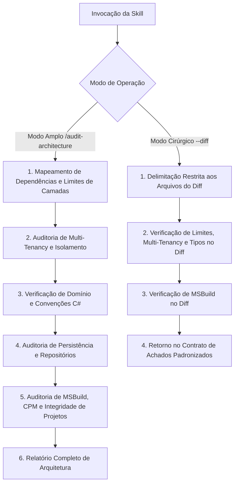

# Auditoria de Arquitetura (Audit Architecture)

Runbook operacional especializado para auditar a conformidade estrutural, fidelidade aos limites de camadas da Clean Architecture, modelagem de domínio (DDD), isolamento rigoroso de multi-tenancy, convenções C# e integridade estrutural de configurações de solução e projetos MSBuild.

---

## Modos de Operação Transparentes

A skill opera em dois modos distintos de execução:

### 1. Modo Amplo (Full Audit)
Invocação manual para análise estrutural da solução completa ou de uma camada específica:
```bash
/audit-architecture
/audit-architecture [caminho_ou_camada]
```
- Produz o relatório analítico completo de conformidade arquitetural e governança.

### 2. Modo Cirúrgico / Focado (Scoped Audit)
Invocação com escopo restrito aos arquivos alterados no diff (utilizado primordialmente pelo orquestrador de `code-review` via subagente):
```bash
/audit-architecture --diff
/audit-architecture --diff [lista_de_arquivos]
```
- Analisa exclusivamente as alterações do diff com isolamento de contexto e retorna os achados estritamente dentro do **Contrato de Achados Padronizados**.

---

## Regras de Governança Aplicáveis

A avaliação arquitetural é regida integralmente pelas regras documentadas em [.agents/rules/](../../rules/):

- **Arquitetura Geral**: Seguir integralmente [.agents/rules/architecture.md](../../rules/architecture.md).
- **Identity & Multi-Tenancy**: Seguir integralmente [.agents/rules/identity-multitenancy.md](../../rules/identity-multitenancy.md).
- **Convenções C#**: Seguir integralmente [.agents/rules/csharp-conventions.md](../../rules/csharp-conventions.md).
- **Domínio**: Seguir integralmente [.agents/rules/domain-rules.md](../../rules/domain-rules.md).
- **Aplicação**: Seguir integralmente [.agents/rules/application-rules.md](../../rules/application-rules.md).
- **Infraestrutura**: Seguir integralmente [.agents/rules/infrastructure-rules.md](../../rules/infrastructure-rules.md).
- **Banco de Dados**: Seguir integralmente [.agents/rules/database-rules.md](../../rules/database-rules.md).

---

## Orquestração de Recursos por Plugin e Origem

A skill `audit-architecture` orquestra as seguintes ferramentas e subagentes especializados:

### Plugin `dotnet-msbuild`
- Subagente `msbuild-code-review`
- Subagente `msbuild`
- Subagente `build-perf`
- Skills `msbuild-antipatterns`, `directory-build-organization`, `including-generated-files`, `check-bin-obj-clash`, `incremental-build`, `copy-to-output-directory`, `binlog-failure-analysis`, `binlog-generation`
- Servidor MCP `binlog`

### Plugin `dotnet-nuget`
- Skill `convert-to-cpm`

### Plugin `dotnet-upgrade`
- Skills `migrate-nullable-references`, `migrate-dotnet9-to-dotnet10`

### Submódulo `postgres-skills`
- Skill `postgres-best-practices`

---

## Fluxo de Execução da Auditoria



---

## Passos de Execução: Modo Amplo (Full Audit)

### Passo 1: Limites de Camadas e Dependências
Mapear as referências entre projetos e acoplamentos estruturais em conformidade com as regras de arquitetura.

### Passo 2: Multi-Tenancy e Isolamento de Contexto
Verificar o fluxo do identificador de tenant, propagação de contexto e blindagem contra vazamento de dados entre clientes conforme as diretrizes de governança.

### Passo 3: Domínio e Convenções C#
Avaliar a pureza da camada de domínio, invariantes DDD e conformidade com as convenções de linguagem C#.

### Passo 4: Persistência e Infraestrutura
Inspecionar repositórios, migrações e mapeamentos sem vazamento de detalhes de persistência para as camadas superiores, acionando a skill `postgres-best-practices` quando aplicável.

### Passo 5: MSBuild, CPM e Configurações de Compilação
Avaliar a estrutura de projetos, propriedades centralizadas (CPM), integridade e performance de compilação acionando os subagentes `msbuild-code-review`, `msbuild`, `build-perf`, as skills `msbuild-antipatterns`, `directory-build-organization`, `convert-to-cpm`, `including-generated-files`, `check-bin-obj-clash`, `incremental-build`, `copy-to-output-directory`, `binlog-failure-analysis`, `binlog-generation` e o servidor MCP `binlog`.

---

## Passos de Execução: Modo Cirúrgico / Focado (`--diff`)

Quando invocado via subagente a partir do `code-review` ou diretamente com `--diff`:

1. **Delimitação Cirúrgica**: Filtrar estritamente os arquivos modificados na sessão/diff.
2. **Verificação de Limites e Multi-Tenancy no Diff**: Avaliar se as alterações respeitam os limites da camada editada e as invariantes de isolamento multi-tenant.
3. **Verificação de Tipos e Convenções**: Avaliar aderência às convenções C# e invariantes de domínio nos arquivos alterados, acionando `migrate-nullable-references` se houver alertas de nulabilidade.
4. **Verificação de Projetos e Build**: Caso o diff inclua arquivos de projeto (`.csproj`, `.props`, `.targets`, `.slnx`), acionar `msbuild-antipatterns` e `msbuild-code-review`.
5. **Emissão de Retorno Padronizado**: Estruturar a resposta estritamente conforme o **Contrato de Achados Padronizados**.

---

## Contrato de Achados Padronizados (Modo Cirúrgico / Focado)

No modo cirúrgico (`--diff`), o subagente deve responder estritamente com a estrutura abaixo, sem relatórios visuais prolixos:

### 1. Síntese Executiva
Um parágrafo conciso resumindo o estado de conformidade arquitetural, governança de multi-tenancy e integridade dos arquivos avaliados no diff.

### 2. Lista de Achados Padronizados
Cada ocorrência deve seguir o formato exato aceito pelo `code-review`, categorizada na dimensão `[Arquitetura & Governança]`:

> **[Severidade] [Arquitetura & Governança]** Título objetivo do achado
> - **Localização**: `caminho/do/arquivo:linha`
> - **Comportamento Atual**: Descrição factual do que foi implementado.
> - **Impacto / Risco Técnico**: Explicação técnica do impacto (vazamento de tenant, quebra de fronteira, acoplamento indevido ou erro estrutural).
> - **Ação Recomendada**: O que deve ser ajustado, acompanhado do trecho de código/diff sugerido.

### 3. Recomendação Formal de Auditoria Ampla
Se durante a análise do diff forem identificadas inconsistências estruturais sistêmicas que extrapolem o escopo imediato das linhas alteradas, incluir recomendação formal:
> ⚠️ **Recomendação**: Inconsistências arquiteturais estruturais identificadas fora do escopo cirúrgico. Recomenda-se executar `/audit-architecture [escopo]` para uma varredura completa.

---

## Estrutura do Relatório de Auditoria Completa (Modo Amplo)

Ao concluir a auditoria no modo amplo, apresentar o resumo estruturado:

### 🏛️ Relatório de Auditoria de Arquitetura

#### Resumo Executivo
- **Escopo Auditado**: [Caminho / Camadas]
- **Status Geral**: [🟢 Conforme | 🟡 Alertas | 🔴 Crítico]
- **Principais Oportunidades Identificadas**: [Resumo objetivo em 1-2 frases]

#### 1. Limites de Camadas e Dependências
- Avaliação da direção das dependências e isolamento entre camadas.

#### 2. Governança de Multi-Tenancy e Segurança
- Avaliação do isolamento de dados e propagação de contexto.

#### 3. Modelagem de Domínio e DDD
- Avaliação da expressividade de domínio, entidades, agregados e invariantes.

#### 4. Integridade MSBuild e Organização de Solução
- Avaliação de propriedades centralizadas, CPM e anti-patterns de build.

#### 5. Achados Detalhados
Cada ocorrência deve seguir o formato padronizado aceito pelo `code-review`:

> **[Severidade] [Arquitetura & Governança]** Título objetivo do achado
> - **Localização**: `caminho/do/arquivo:linha`
> - **Comportamento Atual**: Descrição factual da inconformidade.
> - **Impacto / Risco Técnico**: Explicação técnica do risco à arquitetura ou segurança.
> - **Ação Recomendada**: O que deve ser ajustado conforme as regras do Autogestor.

#### 6. Plano de Ação Prioritário
1. [Correção de riscos de segurança / multi-tenancy]
2. [Ajustes de limites arquiteturais e acoplamentos]
3. [Padronização de convenções e integridade de build]
