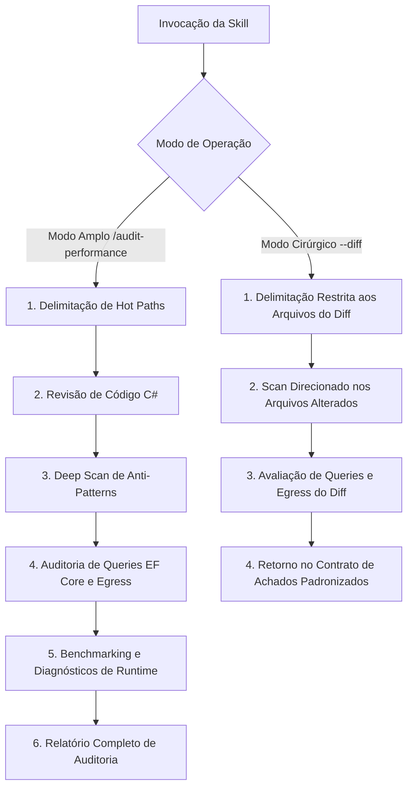

# Auditoria de Performance (Audit Performance)

Runbook operacional especializado para guiar a identificação, diagnóstico e resolução de gargalos de performance, alocações desnecessárias no heap, latência de execução, concorrência, overhead de operações assíncronas, consultas no EF Core, transferência de dados (egress) e benchmarking no ecossistema do Autogestor.

---

## Modos de Operação Transparentes

A skill opera em dois modos distintos de execução:

### 1. Modo Amplo (Full Audit)
Invocação manual para análise aprofundada da solução completa ou de uma camada/projeto específico:
```bash
/audit-performance
/audit-performance [caminho_ou_camada]
```
- Produz o relatório visual completo de auditoria de performance.

### 2. Modo Cirúrgico / Focado (Scoped Audit)
Invocação com escopo restrito aos arquivos alterados no diff (utilizado primordialmente pelo orquestrador de `code-review` via subagente):
```bash
/audit-performance --diff
/audit-performance --diff [lista_de_arquivos]
```
- Analisa exclusivamente as alterações do diff com isolamento de contexto e retorna os achados estritamente dentro do **Contrato de Achados Padronizados**.

---

## Regras de Governança Aplicáveis

A avaliação de performance e eficiência técnica é regida integralmente pelas regras documentadas em [.agents/rules/](../../rules/):

- **Convenções C#**: Seguir integralmente [.agents/rules/csharp-conventions.md](../../rules/csharp-conventions.md).
- **Infraestrutura**: Seguir integralmente [.agents/rules/infrastructure-rules.md](../../rules/infrastructure-rules.md).
- **Banco de Dados**: Seguir integralmente [.agents/rules/database-rules.md](../../rules/database-rules.md).

---

## Orquestração de Recursos por Plugin e Origem

A skill `audit-performance` é a dona exclusiva de toda a eficiência técnica de máquina e performance, orquestrando as seguintes ferramentas especializadas:

### Plugin `dotnet-diag`
- Subagente `optimizing-dotnet-performance`
- Skill `analyzing-dotnet-performance`
- Skill `microbenchmarking`
- Skills `dotnet-trace-collect`, `dump-collect`

### Plugin `dotnet-data`
- Skill `optimizing-ef-core-queries`

### Submódulo `postgres-skills`
- Skill `postgres-best-practices`

### Submódulo `agent-skills`
- Skill `neon-postgres`
- Skill `neon-postgres-egress-optimizer`
- Servidor MCP `neon`

---

## Fluxo de Execução da Auditoria



---

## Passos de Execução: Modo Amplo (Full Audit)

### Passo 1: Delimitação de Hot Paths
Identificar fluxos críticos de execução no escopo avaliado, desconsiderando rotinas fora do caminho crítico.

### Passo 2: Avaliação Técnica de Código C#
Conduzir análise técnica dos fluxos críticos em conformidade estrita com [.agents/rules/csharp-conventions.md](../../rules/csharp-conventions.md), acionando o subagente `optimizing-dotnet-performance`.

### Passo 3: Deep Scan de Anti-Patterns
Invocar a skill `analyzing-dotnet-performance` nos arquivos do escopo avaliado para detecção sistemática de anti-patterns de máquina.

### Passo 4: Auditoria de Banco de Dados, Persistência e Egress
Seguir integralmente [.agents/rules/infrastructure-rules.md](../../rules/infrastructure-rules.md) e [.agents/rules/database-rules.md](../../rules/database-rules.md), acionando as skills `optimizing-ef-core-queries`, `postgres-best-practices`, `neon-postgres` e `neon-postgres-egress-optimizer` e o servidor MCP `neon`.

### Passo 5: Benchmarking e Diagnósticos de Runtime
Para validação empírica e diagnósticos de runtime, acionar a skill `microbenchmarking` ou planejar coleta com `dotnet-trace-collect` e `dump-collect`.

---

## Passos de Execução: Modo Cirúrgico / Focado (`--diff`)

Quando invocado via subagente a partir do `code-review` ou diretamente com `--diff`:

1. **Delimitação Cirúrgica**: Filtrar estritamente os arquivos modificados na sessão/diff pertencentes a C# de produção e persistência.
2. **Scan Focado de Código C#**: Executar `analyzing-dotnet-performance` exclusivamente sobre os arquivos alterados.
3. **Auditoria de Persistência no Diff**: Caso o diff contenha mapeamentos, repositórios ou consultas de banco de dados, executar `optimizing-ef-core-queries`, `postgres-best-practices`, `neon-postgres` e `neon-postgres-egress-optimizer`.
4. **Emissão de Retorno Padronizado**: Estruturar a resposta estritamente conforme o **Contrato de Achados Padronizados**.

---

## Contrato de Achados Padronizados (Modo Cirúrgico / Focado)

No modo cirúrgico (`--diff`), o subagente deve responder estritamente com a estrutura abaixo, sem relatórios visuais prolixos:

### 1. Síntese Executiva
Um parágrafo conciso resumindo o estado de eficiência técnica de máquina dos arquivos avaliados no diff.

### 2. Lista de Achados Padronizados
Cada ocorrência deve seguir o formato exato aceito pelo `code-review`:

> **[Severidade] [Performance & Recursos]** Título objetivo do achado
> - **Localização**: `caminho/do/arquivo:linha`
> - **Comportamento Atual**: Descrição factual do que foi implementado.
> - **Impacto / Risco Técnico**: Explicação técnica do impacto (alocações de memória, overhead de CPU, bloqueios de thread ou I/O).
> - **Ação Recomendada**: O que deve ser ajustado, acompanhado do trecho de código/diff sugerido.

### 3. Recomendação Formal de Auditoria Ampla
Se durante a análise do diff forem identificados gargalos sistêmicos, vazamento de abstrações de dados ou problemas que extrapolam o escopo imediato das linhas alteradas, incluir recomendação formal:
> ⚠️ **Recomendação**: Problemas estruturais de performance identificados fora do escopo cirúrgico. Recomenda-se executar `/audit-performance [escopo]` para uma varredura completa da camada.

---

## Estrutura do Relatório de Auditoria Completa (Modo Amplo)

Ao concluir a auditoria no modo amplo, apresentar o relatório formatado:

### ⚡ Relatório de Auditoria de Performance

#### Resumo Executivo
- **Escopo Auditado**: [Caminho / Camadas]
- **Principais Oportunidades Identificadas**: [Resumo objetivo em 1-2 frases]

#### 1. Revisão Arquitetural de Hot Paths
- **Gargalos Estruturais**: Identificação de pontos com sobrecarga de CPU ou alocações no heap.
- **Trade-offs Considerados**: Clareza de código vs ganho real de vazão de processamento.

#### 2. Varredura de Anti-Patterns (Deep Scan)
| Severidade | Categoria | Localização | Descrição do Anti-Pattern |
| :---: | :--- | :--- | :--- |
| [Severidade] | [Categoria Técnica] | `caminho/do/arquivo:linha` | [Descrição factual do anti-pattern identificado] |

#### 3. Auditoria de Persistência e Egress
- Análise de consultas EF Core, rastreamento de entidades e transferência de dados (egress).

#### 4. Diretrizes para Validação Empírica (Benchmarking)
- Acionamento da skill `microbenchmarking` para validação empírica nos cenários recomendados.

#### 5. Recomendações Acionáveis
> **[Severidade] [Performance & Recursos]** Título da Otimização
> - **Localização**: `caminho/do/arquivo:linha`
> - **Comportamento Atual**: Descrição factual do gargalo identificado.
> - **Impacto / Risco Técnico**: Explicação técnica do impacto (alocações, latência, contenção).
> - **Ação Recomendada**: Ajuste conceitual otimizado em conformidade com as regras do Autogestor.
