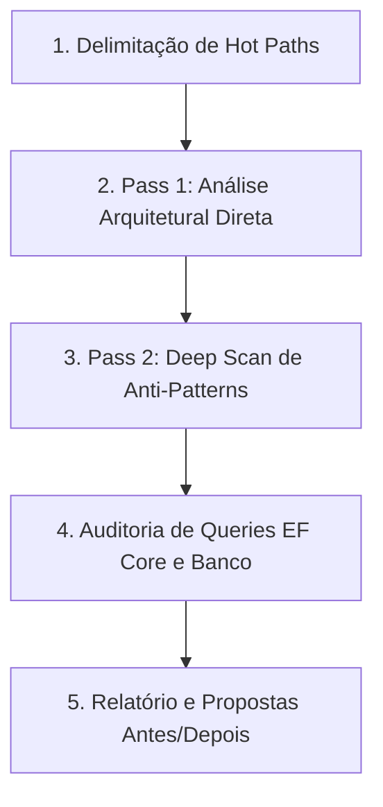

# Auditoria de Performance (Audit Performance)

Runbook operacional especializado para guiar a identificação, diagnóstico e resolução de gargalos de performance, alocações desnecessárias no heap, ineficiências em rotinas assíncronas, overhead de persistência no EF Core e preparação para compilação AOT no ecossistema do Autogestor.

## Como Usar
Invoque esta skill utilizando o comando:
```bash
/audit-performance [caminho_ou_camada_opcional]
```
Exemplos:
- `/audit-performance` (audita toda a solução focando nos fluxos críticos)
- `/audit-performance src/Autogestor.Application` (audita orquestrações de casos de uso e handlers)
- `/audit-performance src/Autogestor.Infrastructure` (audita consultas EF Core, repositórios e interceptadores)
- `/audit-performance src/Autogestor.Api` (audita latência de endpoints gRPC, Kestrel e middlewares)
- `/audit-performance src/Autogestor.Web` (audita inicialização WASM e compatibilidade AOT)

---

## Fluxo de Execução da Auditoria



---

## Orquestração de Recursos por Plugin e Origem

### Plugin `dotnet-diag`
- Subagente `optimizing-dotnet-performance`
- Skill `analyzing-dotnet-performance`
- Skill `microbenchmarking`
- Skills `dotnet-trace-collect`, `dump-collect`

### Plugin `dotnet-msbuild`
- Subagente `build-perf`
- Skills `incremental-build`, `copy-to-output-directory`
- Servidor MCP `binlog`

### Plugin `dotnet-data`
- Skill `optimizing-ef-core-queries`

### Plugin `dotnet-upgrade`
- Skill `dotnet-aot-compat`

### Submódulo `agent-skills`
- Skill `neon-postgres-egress-optimizer`
- Servidor MCP `neon`

### Submódulo `ponytail`
- Skills `ponytail-review`, `ponytail-gain`

---

## Passos de Execução da Auditoria

### Passo 1: Delimitação de Hot Paths
Identificar os fluxos críticos e de alta frequência de execução no escopo avaliado, desconsiderando rotinas de inicialização única, migrações pontuais ou código de suporte fora do caminho crítico.

### Passo 2: Pass 1 — Revisão Arquitetural Direta
Conduzir análise direta dos fluxos críticos em conformidade estrita com [.agents/rules/csharp-conventions.md](../../rules/csharp-conventions.md).

### Passo 3: Pass 2 — Deep Scan de Anti-Patterns
Invocar a skill `analyzing-dotnet-performance` nos arquivos do escopo.

### Passo 4: Auditoria de Banco de Dados e Persistência
Seguir integralmente [.agents/rules/infrastructure-rules.md](../../rules/infrastructure-rules.md) e [.agents/rules/database-rules.md](../../rules/database-rules.md), acionando as skills `optimizing-ef-core-queries` e `neon-postgres-egress-optimizer` e o servidor MCP `neon`.

### Passo 5: Avaliação Anti-Overengineering
Acionar as skills `ponytail-review` e `ponytail-gain` no escopo avaliado.

---

## Estrutura do Relatório de Auditoria

Ao concluir a auditoria, apresentar o relatório formatado:

### ⚡ Relatório de Auditoria de Performance

#### Resumo Executivo
- **Escopo Auditado**: [Caminho / Camadas]
- **Principais Oportunidades Identificadas**: [Resumo objetivo em 1-2 frases]

#### Pass 1: Revisão Arquitetural de Hot Paths
- **Gargalos Estruturais**: Identificação de pontos com sobrecarga desnecessária de CPU ou alocações de memória.
- **Trade-offs Considerados**: Clareza de código vs ganho real de throughput.

#### Pass 2: Varredura de Anti-Patterns (Deep Scan)
| Severidade | Categoria | Localização | Descrição do Anti-Pattern |
| :---: | :--- | :--- | :--- |
| 🔴 Crítico | Async / I/O | `src/.../Handler.cs:42` | Bloqueio síncrono ou overhead em async |
| 🟡 Moderado | Memória | `src/.../Service.cs:88` | Alocação repetitiva sem reutilização |
| ℹ️ Info | LINQ | `src/.../Repository.cs:15` | Múltipla enumeração ou projeção ineficiente |

#### Recomendações Acionáveis (Código Antes / Depois)

##### 1. [Título da Otimização]
- **Localização**: `caminho/do/arquivo.cs:linha`
- **Causa Raiz**: [Explicação técnica do impacto]
- **Impacto Esperado**: [Ex: Eliminação de alocações no heap em hot path]

```csharp
// ❌ Antes:
[Código original ineficiente]

// ✅ Depois:
[Código otimizado em conformidade com as regras do Autogestor]
```

#### Diretrizes para Validação Empírica (Benchmarking)
- Acionar a skill `microbenchmarking` para validação empírica nos cenários recomendados.
