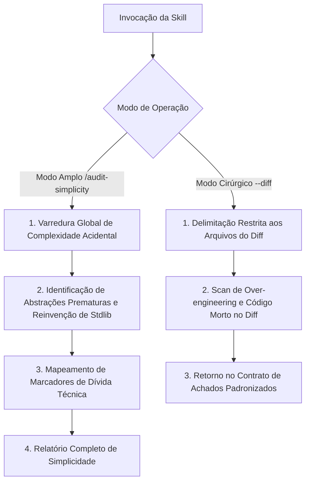

# Auditoria de Simplicidade (Audit Simplicity)

Runbook operacional especializado para auditar e eliminar complexidade desnecessária, abstrações prematuras, sobre-engenharia (*over-engineering*), código defensivo redundante e violações do princípio YAGNI (*You Aren't Gonna Need It*) no ecossistema do Autogestor.

---

## Modos de Operação Transparentes

A skill opera em dois modos distintos de execução:

### 1. Modo Amplo (Full Audit)
Invocação manual para análise de simplicidade da base de código inteira ou de um módulo específico:
```bash
/audit-simplicity
/audit-simplicity [caminho_ou_camada]
```
- Produz o relatório analítico completo de oportunidades de simplificação e dívida de complexidade.

### 2. Modo Cirúrgico / Focado (Scoped Audit)
Invocação com escopo restrito aos arquivos alterados no diff (utilizado primordialmente pelo orquestrador de `code-review` via subagente):
```bash
/audit-simplicity --diff
/audit-simplicity --diff [lista_de_arquivos]
```
- Analisa exclusivamente as alterações do diff com isolamento de contexto e retorna os achados estritamente dentro do **Contrato de Achados Padronizados**.

---

## Regras de Governança Aplicáveis

A postura de simplicidade é regida pela diretriz de engenharia sênior documentada em [AGENTS.md](../../../AGENTS.md):

- **Diretriz de Agnosticismo**: Análise factual de necessidade estrita e aderência a recursos nativos da plataforma antes da introdução de novos padrões.

---

## Orquestração de Recursos por Plugin e Origem

A skill `audit-simplicity` é a dona exclusiva da dimensão de anti-overengineering e simplificação, orquestrando as seguintes ferramentas do submódulo `ponytail`:

### Submódulo `ponytail`
- Skill `ponytail-review`
- Skill `ponytail-audit`
- Skill `ponytail-debt`
- Skill `ponytail-gain`
- Skill `ponytail`
- Skill `ponytail-help`

---

## Fluxo de Execução da Auditoria



---

## Passos de Execução: Modo Amplo (Full Audit)

### Passo 1: Varredura Geral de Complexidade Acidental
Executar a skill `ponytail-audit` para varrer a base de código em busca de código inflado, indireções desnecessárias, interfaces com implementação única sem justificativa e padrões defensivos redundantes.

### Passo 2: Análise de Abstrações e Stdlib
Verificar se métodos auxiliares ou classes customizadas duplicam capacidades nativas do C# moderno e do .NET Runtime.

### Passo 3: Rastreamento de Dívida de Complexidade
Executar a skill `ponytail-debt` para consolidar anotações de atalhos e adiamentos deliberados, avaliando o impacto consolidado com `ponytail-gain`.

---

## Passos de Execução: Modo Cirúrgico / Focado (`--diff`)

Quando invocado via subagente a partir do `code-review` ou diretamente com `--diff`:

1. **Delimitação Cirúrgica**: Filtrar estritamente os arquivos modificados na sessão/diff.
2. **Scan Focado de Simplicidade**: Executar `ponytail-review` exclusivamente sobre as alterações do diff.
3. **Detecção de Código Morto e Abstrações**: Verificar se as alterações adicionam nós, wrappers, handlers vazios ou bifurcações especulativas não exigidas pelo caso de uso atual.
4. **Emissão de Retorno Padronizado**: Estruturar a resposta estritamente conforme o **Contrato de Achados Padronizados**.

---

## Contrato de Achados Padronizados (Modo Cirúrgico / Focado)

No modo cirúrgico (`--diff`), o subagente deve responder estritamente com a estrutura abaixo, sem relatórios visuais prolixos:

### 1. Síntese Executiva
Um parágrafo conciso resumindo o nível de pragmatismo, ausência de sobre-engenharia e simplicidade das alterações do diff.

### 2. Lista de Achados Padronizados
Cada ocorrência deve seguir o formato exato aceito pelo `code-review`, categorizada na dimensão `[Simplicidade & Anti-Overengineering]`:

> **[Severidade] [Simplicidade & Anti-Overengineering]** Título objetivo do achado
> - **Localização**: `caminho/do/arquivo:linha`
> - **Comportamento Atual**: Descrição factual da sobre-engenharia, abstração prematura ou código morto.
> - **Impacto / Risco Técnico**: Explicação do impacto (complexidade cognitiva, custo de manutenção, indireção desnecessária).
> - **Ação Recomendada**: Proposta de simplificação direta e objetiva, acompanhada do trecho enxuto sugerido.

### 3. Recomendação Formal de Auditoria Ampla
Se durante a análise do diff forem identificadas estruturas acidentalmente complexas que se propagam por módulos não modificados, incluir recomendação formal:
> ⚠️ **Recomendação**: Padrões de over-engineering estruturais identificados fora do escopo cirúrgico. Recomenda-se executar `/audit-simplicity [escopo]` para uma varredura completa.

---

## Estrutura do Relatório de Auditoria Completa (Modo Amplo)

Ao concluir a auditoria no modo amplo, apresentar o resumo estruturado:

### ✂️ Relatório de Auditoria de Simplicidade

#### Resumo Executivo
- **Escopo Auditado**: [Caminho / Camadas]
- **Status Geral**: [🟢 Enxuto | 🟡 Atenção | 🔴 Sobre-engenharia]
- **Principais Oportunidades Identificadas**: [Resumo objetivo em 1-2 frases]

#### 1. Abstrações Prematuras e Indireções
- Identificação de interfaces, classes base ou delegações desnecessárias.

#### 2. Reinvenção de Recursos Nativos
- Substituições recomendadas por construções nativas da biblioteca padrão.

#### 3. Eliminação de Código Morto e Defensivo Redundante
- Trechos inalcançáveis, verificações duplicadas ou branches desnecessárias.

#### 4. Achados Detalhados
Cada ocorrência deve seguir o formato padronizado aceito pelo `code-review`:

> **[Severidade] [Simplicidade & Anti-Overengineering]** Título objetivo do achado
> - **Localização**: `caminho/do/arquivo:linha`
> - **Comportamento Atual**: Descrição factual do que foi implementado de forma complexa.
> - **Impacto / Risco Técnico**: Explicação do custo cognitivo ou de manutenção.
> - **Ação Recomendada**: O que deve ser deletado, enxugado ou simplificado.

#### 5. Plano de Simplificação Prioritário
1. [Remoção de camadas ou classes supérfluas]
2. [Substituição por padrão nativo do .NET]
3. [Limpeza de código morto e simplificação de assinaturas]
