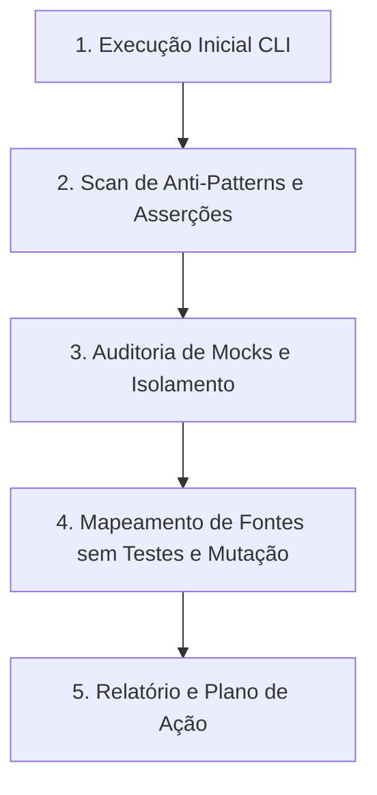

# Auditoria de Testes (Audit Tests)

Runbook operacional para conduzir uma auditoria técnica completa e multidimensional da suíte de testes do Autogestor (`UnitTests`, `IntegrationTests` e `ArchitectureTests`), avaliando qualidade de asserções, anti-patterns, testes falsos-positivos, mutações não capturadas e manutenibilidade.

## Como Usar
Invoque esta skill utilizando o comando:
```bash
/audit-tests [caminho_ou_projeto_opcional]
```
Exemplos:
- `/audit-tests` (audita toda a suíte de testes da solução)
- `/audit-tests test/Autogestor.UnitTests` (foco nos testes unitários)
- `/audit-tests test/Autogestor.IntegrationTests` (foco nos testes de integração)
- `/audit-tests test/Autogestor.ArchitectureTests` (foco nos testes de arquitetura)

---

## Estrutura da Suíte do Projeto

| Projeto de Teste | Regra de Governança |
| :--- | :--- |
| `Autogestor.UnitTests` | Seguir integralmente [.agents/rules/unit-testing-rules.md](../../rules/unit-testing-rules.md) |
| `Autogestor.IntegrationTests` | Seguir integralmente [.agents/rules/integration-testing-rules.md](../../rules/integration-testing-rules.md) |
| `Autogestor.ArchitectureTests` | Seguir integralmente [.agents/rules/architecture-testing-rules.md](../../rules/architecture-testing-rules.md) |

---

## Fluxo de Execução da Auditoria



---

## Orquestração de Recursos por Plugin e Origem

### Plugin `dotnet-test`
- Subagente `test-quality-auditor`
- Skills `test-anti-patterns`, `assertion-quality`
- Skills `test-gap-analysis`, `test-analysis-extensions`
- Skills `find-untested-sources`, `coverage-analysis`, `crap-score`

### Plugin `dotnet-experimental`
- Skills `exp-mock-usage-analysis`, `exp-test-maintainability`

### Plugin `dotnet-test-migration`
- Skills `migrate-xunit-to-xunit-v3`, `migrate-vstest-to-mtp`

### Plugin `dotnet-msbuild`
- Subagente `msbuild-code-review`

### Submódulo `agent-skills`
- Skill `neon-postgres-branches`
- Servidor MCP `neon`

---

## Passos de Execução da Auditoria

### Passo 1: Execução e Diagnóstico Inicial (CLI)
Executar a suíte de testes com o proxy `rtk` para estabelecer o estado atual:
```bash
rtk dotnet test
```
Se especificado um projeto ou caminho alvo:
```bash
rtk dotnet test [caminho_do_projeto]
```

### Passo 2: Varredura de Anti-Patterns e Qualidade das Asserções
- Executar a skill `test-anti-patterns` nos arquivos de teste do escopo.
- Executar a skill `assertion-quality` nos testes do escopo.
- Consultar e seguir integralmente [.agents/rules/csharp-conventions.md](../../rules/csharp-conventions.md) e [AGENTS.md](../../../AGENTS.md).

### Passo 3: Auditoria de Mocks e Isolamento
- Em `Autogestor.UnitTests`, acionar a skill `exp-mock-usage-analysis` e seguir integralmente [.agents/rules/unit-testing-rules.md](../../rules/unit-testing-rules.md).
- Em `Autogestor.IntegrationTests`, seguir integralmente [.agents/rules/integration-testing-rules.md](../../rules/integration-testing-rules.md).
- Em `Autogestor.ArchitectureTests`, seguir integralmente [.agents/rules/architecture-testing-rules.md](../../rules/architecture-testing-rules.md).

### Passo 4: Mapeamento de Fontes sem Testes e Pontos Cegos
- Executar a skill `find-untested-sources` no escopo avaliado.
- Executar a skill `test-gap-analysis` nos fluxos críticos do escopo avaliado.

---

## Estrutura do Relatório de Auditoria

Ao concluir a auditoria, apresentar o resumo estruturado:

### 🧪 Relatório de Auditoria de Testes

#### Resumo da Suíte
- **Projetos Auditados**: [Autogestor.UnitTests / IntegrationTests / ArchitectureTests]
- **Status Geral**: [🟢 Saudável | 🟡 Atenção | 🔴 Crítico]
- **Total de Testes Executados**: N testes (N aprovados, N falhas)

#### Matriz de Qualidade por Dimensão
| Dimensão | Avaliação | Achados Principais |
| :--- | :---: | :--- |
| **Anti-Patterns** | [OK / Alerta] | Testes vazios, tautologias, exceções ignoradas |
| **Profundidade de Asserções** | [OK / Alerta] | Asserções de estado completo vs checagens superficiais |
| **Pontos Cegos (Mutação)** | [OK / Alerta] | Cenários de borda que não causariam falha se modificados |
| **Auditoria de Mocks** | [OK / Alerta] | Setups desnecessários ou dublês no lugar de instâncias reais |
| **Fontes sem Cobertura** | [OK / Alerta] | Classes de domínio ou aplicação desprovidas de testes |

#### Achados Detalhados
> **[Severidade: Crítico / Importante / Sugestão] [Arquivo:Linha]** Título do Achado
> - **Problema**: Descrição factual da fraqueza do teste.
> - **Risco**: Impacto técnico no ciclo de desenvolvimento ou produção.
> - **Correção Recomendada**: Código de teste corrigido com asserções ricas.

#### Plano de Ação Prioritário
1. [Ação imediata para testes críticos]
2. [Melhoria de asserções em fluxos de negócio]
3. [Remoção de dublês redundantes e simplificação]
