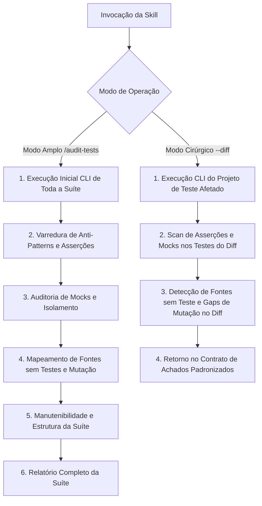

# Auditoria de Testes (Audit Tests)

Runbook operacional especializado para auditar a qualidade técnica, profundidade, confiabilidade e cobertura da suíte de testes do Autogestor (`UnitTests`, `IntegrationTests` e `ArchitectureTests`), garantindo prevenção ativa de regressões, asserções de alto valor, ausência de testes vazios ou anti-patterns, uso correto de dublês de teste e detecção de pontos cegos de mutação.

---

## Modos de Operação Transparentes

A skill opera em dois modos distintos de execução:

### 1. Modo Amplo (Full Audit)
Invocação manual para auditoria aprofundada de toda a suíte de testes ou de um projeto específico:
```bash
/audit-tests
/audit-tests [caminho_ou_projeto]
```
- Executa a suíte e produz o relatório visual analítico completo de auditoria de testes.

### 2. Modo Cirúrgico / Focado (Scoped Audit)
Invocação com escopo restrito aos arquivos alterados no diff (utilizado primordialmente pelo orquestrador de `code-review` via subagente):
```bash
/audit-tests --diff
/audit-tests --diff [lista_de_arquivos]
```
- Executa via CLI os testes dos projetos impactados (`rtk dotnet test [projeto_afetado]`) para prevenção imediata de regressões, analisa as alterações do diff com isolamento de contexto e retorna os achados estritamente dentro do **Contrato de Achados Padronizados**.

---

## Estrutura da Suíte do Projeto & Regras de Governança

| Projeto / Escopo de Teste | Regra de Governança |
| :--- | :--- |
| `Autogestor.UnitTests` | Seguir integralmente [.agents/rules/unit-testing-rules.md](../../rules/unit-testing-rules.md) |
| `Autogestor.IntegrationTests` | Seguir integralmente [.agents/rules/integration-testing-rules.md](../../rules/integration-testing-rules.md) |
| `Autogestor.ArchitectureTests` | Seguir integralmente [.agents/rules/architecture-testing-rules.md](../../rules/architecture-testing-rules.md) |
| Convenções Globais de Teste | Seguir integralmente [.agents/rules/csharp-conventions.md](../../rules/csharp-conventions.md) |

---

## Orquestração de Recursos por Plugin e Origem

A skill `audit-tests` é a dona exclusiva de toda a saúde, qualidade e integridade da suíte de testes, orquestrando as seguintes ferramentas especializadas:

### Plugin `dotnet-test`
- Subagente `test-quality-auditor`
- Skills `assertion-quality`, `test-anti-patterns`
- Skills `test-gap-analysis`, `test-analysis-extensions`
- Skills `find-untested-sources`, `coverage-analysis`, `crap-score`

### Plugin `dotnet-experimental`
- Skills `exp-mock-usage-analysis`, `exp-test-maintainability`

### Plugin `dotnet-test-migration`
- Skills `migrate-xunit-to-xunit-v3`, `migrate-vstest-to-mtp`

### Submódulo `agent-skills`
- Skill `neon-postgres-branches`
- Servidor MCP `neon`

---

## Fluxo de Execução da Auditoria



---

## Passos de Execução: Modo Amplo (Full Audit)

### Passo 1: Execução e Diagnóstico Inicial (CLI)
Executar a validação da suíte de testes com o proxy `rtk`. Para garantir a execução completa de cada suíte no .NET 10, recomenda-se a execução explícita por projeto:
```bash
rtk dotnet test --project test/Autogestor.ArchitectureTests
rtk dotnet test --project test/Autogestor.UnitTests
rtk dotnet test --project test/Autogestor.IntegrationTests
```
Ou para execução via arquivo de solução:
```bash
rtk dotnet test --solution Autogestor.slnx
```

### Passo 2: Varredura de Anti-Patterns e Qualidade das Asserções
- Executar a skill `test-anti-patterns` nos arquivos de teste do escopo.
- Executar a skill `assertion-quality` nos testes do escopo.
- Consultar e seguir integralmente [.agents/rules/csharp-conventions.md](../../rules/csharp-conventions.md) e [AGENTS.md](../../../AGENTS.md).

### Passo 3: Auditoria de Mocks e Isolamento
- Em `Autogestor.UnitTests`, acionar a skill `exp-mock-usage-analysis` e seguir integralmente [.agents/rules/unit-testing-rules.md](../../rules/unit-testing-rules.md).
- Em `Autogestor.IntegrationTests`, seguir integralmente [.agents/rules/integration-testing-rules.md](../../rules/integration-testing-rules.md) e utilizar o servidor MCP `neon` / `neon-postgres-branches` para isolamento de dados quando aplicável.
- Em `Autogestor.ArchitectureTests`, seguir integralmente [.agents/rules/architecture-testing-rules.md](../../rules/architecture-testing-rules.md).

### Passo 4: Mapeamento de Fontes sem Testes e Pontos Cegos
- Executar a skill `find-untested-sources` no escopo avaliado.
- Executar a skill `test-gap-analysis` nos fluxos críticos do escopo avaliado.
- Avaliar métricas de complexidade e risco com as skills `coverage-analysis` e `crap-score`.

### Passo 5: Manutenibilidade e Estrutura da Suíte
- Identificar duplicidade e oportunidades de consolidação de testes com `exp-test-maintainability`.
- Avaliar a configuração de runner e plugins de execução dos projetos de teste (`migrate-xunit-to-xunit-v3`, `migrate-vstest-to-mtp`).

---

## Passos de Execução: Modo Cirúrgico / Focado (`--diff`)

Quando invocado via subagente a partir do `code-review` ou diretamente com `--diff`:

1. **Prevenção Ativa de Regressões (CLI)**: Identificar os projetos de teste impactados pelas alterações no diff e executar a validação imediata via CLI com prefixo `rtk`:
   ```bash
   rtk dotnet test --project [projeto_afetado]
   ```
   Exemplos de escopos direcionados conforme as camadas modificadas:
   - Testes unitários afetados: `rtk dotnet test --project test/Autogestor.UnitTests`
   - Testes de integração afetados: `rtk dotnet test --project test/Autogestor.IntegrationTests`
   - Testes de arquitetura afetados: `rtk dotnet test --project test/Autogestor.ArchitectureTests`
   - Múltiplas camadas afetadas: `rtk dotnet test --solution Autogestor.slnx`
2. **Avaliação de Testes Alterados no Diff**: Caso o diff contenha arquivos de teste modificados, acionar `test-anti-patterns`, `assertion-quality` e `exp-mock-usage-analysis` restritos a esses arquivos.
3. **Avaliação de Código de Produção no Diff**: Caso o diff contenha novos arquivos ou métodos em camadas de produção, acionar `find-untested-sources` para verificar existência de testes correspondentes e `test-gap-analysis` para avaliar se os testes existentes capturam alterações comportamentais.
4. **Emissão de Retorno Padronizado**: Estruturar a resposta estritamente conforme o **Contrato de Achados Padronizados**.

---

## Contrato de Achados Padronizados (Modo Cirúrgico / Focado)

No modo cirúrgico (`--diff`), o subagente deve responder estritamente com a estrutura abaixo, sem relatórios visuais prolixos:

### 1. Síntese Executiva
Um parágrafo conciso informando o resultado da execução dos testes dos projetos afetados via CLI (`rtk dotnet test [projeto]`) e o status da qualidade das asserções e cobertura do diff.

### 2. Lista de Achados Padronizados
Cada ocorrência deve seguir o formato exato aceito pelo `code-review`:

> **[Severidade] [Qualidade e Cobertura de Testes]** Título objetivo do achado
> - **Localização**: `caminho/do/arquivo:linha`
> - **Comportamento Atual**: Descrição factual da fraqueza do teste ou ausência de cobertura.
> - **Impacto / Risco Técnico**: Explicação do risco de regressão, falso-positivo ou ponto cego no comportamento do sistema.
> - **Ação Recomendada**: O que deve ser ajustado, acompanhado do trecho de teste corrigido.

### 3. Recomendação Formal de Auditoria Ampla
Se durante a análise do diff forem identificadas falhas estruturais generalizadas na suíte, quebra recorrente de isolamento ou débito técnico extenso de testes que extrapole as alterações do diff, incluir recomendação formal:
> ⚠️ **Recomendação**: Problemas estruturais na suíte de testes identificados fora do escopo cirúrgico. Recomenda-se executar `/audit-tests [projeto]` para uma varredura completa.

---

## Estrutura do Relatório de Auditoria Completa (Modo Amplo)

Ao concluir a auditoria no modo amplo, apresentar o resumo estruturado:

### 🧪 Relatório de Auditoria de Testes

#### Resumo da Suíte
- **Projetos Auditados**: [Autogestor.UnitTests / IntegrationTests / ArchitectureTests]
- **Status Geral**: [🟢 Saudável | 🟡 Atenção | 🔴 Crítico]
- **Total de Testes Executados**: N testes (N aprovados, N falhas)

#### Matriz de Qualidade por Dimensão
| Dimensão | Avaliação | Achados Principais |
| :--- | :---: | :--- |
| **Anti-Patterns** | [OK / Alerta] | [Síntese factual dos achados na dimensão] |
| **Profundidade de Asserções** | [OK / Alerta] | [Síntese factual dos achados na dimensão] |
| **Pontos Cegos (Mutação)** | [OK / Alerta] | [Síntese factual dos achados na dimensão] |
| **Auditoria de Mocks** | [OK / Alerta] | [Síntese factual dos achados na dimensão] |
| **Fontes sem Cobertura** | [OK / Alerta] | [Síntese factual dos achados na dimensão] |
| **Manutenibilidade** | [OK / Alerta] | [Síntese factual dos achados na dimensão] |

#### Achados Detalhados
Cada ocorrência deve seguir o formato padronizado aceito pelo `code-review`:

> **[Severidade] [Qualidade e Cobertura de Testes]** Título objetivo do achado
> - **Localização**: `caminho/do/arquivo:linha`
> - **Comportamento Atual**: Descrição factual da fraqueza do teste ou ausência de cobertura.
> - **Impacto / Risco Técnico**: Explicação do risco de regressão, falso-positivo ou ponto cego no comportamento do sistema.
> - **Ação Recomendada**: O que deve ser ajustado, acompanhado da proposta de teste corrigida com asserções ricas.

#### Plano de Ação Prioritário
1. [Ação imediata para testes críticos]
2. [Melhoria de asserções em fluxos de negócio]
3. [Remoção de dublês redundantes e simplificação]
