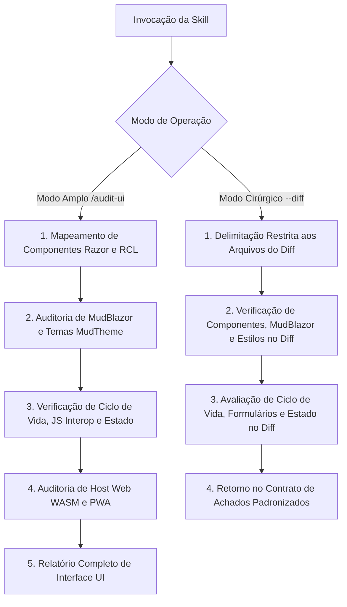

# Auditoria de Interface e Componentes UI (Audit UI)

Runbook operacional especializado para auditar a camada de apresentação frontend Blazor (`Autogestor.UI` e `Autogestor.Web`): componentes Razor, Razor Class Library (RCL), ecossistema MudBlazor, centralização de tokens de design via `MudTheme`, isolamento host-agnostic, ciclo de vida de componentes, interoperabilidade JavaScript, formulários e validação, coordenação de estado e roteamento WebAssembly/PWA.

---

## Modos de Operação Transparentes

A skill opera em dois modos distintos de execução:

### 1. Modo Amplo (Full Audit)
Invocação manual para análise estrutural e de interface da solução completa ou de uma camada/componente específico:
```bash
/audit-ui
/audit-ui [caminho_ou_camada]
```
- Produz o relatório analítico completo de interface e componentes Blazor.

### 2. Modo Cirúrgico / Focado (Scoped Audit)
Invocação com escopo restrito aos arquivos alterados no diff (utilizado primordialmente pelo orquestrador de `code-review` via subagente):
```bash
/audit-ui --diff
/audit-ui --diff [lista_de_arquivos]
```
- Analisa exclusivamente as alterações do diff com isolamento de contexto e retorna os achados estritamente dentro do **Contrato de Achados Padronizados**.

---

## Regras de Governança Aplicáveis

A avaliação de interface e componentes de apresentação é regida integralmente pelas regras documentadas em [.agents/rules/](../../rules/):

- **UI (RCL)**: Seguir integralmente [.agents/rules/ui-rules.md](../../rules/ui-rules.md).
- **Web (WASM)**: Seguir integralmente [.agents/rules/web-rules.md](../../rules/web-rules.md).
- **Convenções C#**: Seguir integralmente [.agents/rules/csharp-conventions.md](../../rules/csharp-conventions.md).

---

## Orquestração de Recursos por Plugin e Origem

A skill `audit-ui` orquestra as seguintes ferramentas especializadas:

### Plugin `dotnet-blazor`
- Skill `author-component`
- Skill `collect-user-input`
- Skill `coordinate-components`
- Skill `fetch-and-send-data`
- Skill `plan-ui-change`
- Skill `support-prerendering`
- Skill `use-js-interop`
- Skill `configure-auth`

### Plugin `dotnet-aspnetcore`
- Skill `convert-blazor-server-to-webapp`

### Plugin `dotnet-data`
- Skill `create-datadriven-aspnetcore`

---

## Fluxo de Execução da Auditoria



---

## Passos de Execução: Modo Amplo (Full Audit)

### Passo 1: Componentes Razor e Estrutura RCL
Auditar a modularidade e estrutura dos componentes Razor, decomposição visual e isolamento host-agnostic em conformidade com as regras de UI e as skills `author-component`, `plan-ui-change` e `create-datadriven-aspnetcore`.

### Passo 2: MudBlazor e Centralização de Estilos
Verificar o uso consistente de componentes MudBlazor e a vinculação rigorosa aos tokens de design do `MudTheme`, identificando eventuais estilos inline ou cores hardcoded.

### Passo 3: Ciclo de Vida, Formulários, JS Interop e Estado
Avaliar o ciclo de vida dos componentes, formulários e validação, manuseio assíncrono de dados, isolamento de chamadas JS interop, coordenação de estado e autenticação acionando as skills `collect-user-input`, `coordinate-components`, `fetch-and-send-data`, `support-prerendering`, `use-js-interop` e `configure-auth`.

### Passo 4: Host WebAssembly e PWA
Auditar a configuração do projeto host (`Autogestor.Web`), roteador, assets estáticos, service workers e integração gRPC-Web no cliente utilizando `convert-blazor-server-to-webapp` e as regras de Web.

---

## Passos de Execução: Modo Cirúrgico / Focado (`--diff`)

Quando invocado via subagente a partir do `code-review` ou diretamente com `--diff`:

1. **Delimitação Cirúrgica**: Filtrar estritamente os arquivos modificados na sessão/diff pertencentes às camadas de UI (`Autogestor.UI`) e Web (`Autogestor.Web`).
2. **Verificação de Componentes e MudBlazor no Diff**: Analisar os arquivos `.razor` e `.cs` alterados, validando a ausência de estilos inline, aderência a tokens do `MudTheme` e modularidade com `author-component` e `plan-ui-change`.
3. **Verificação de Ciclo de Vida, Formulários e Estado no Diff**: Avaliar formulários (`collect-user-input`), sincronização de estado (`coordinate-components`), ciclo de vida assíncrono (`fetch-and-send-data`, `support-prerendering`) e chamadas JavaScript (`use-js-interop`).
4. **Verificação de Host e Roteamento no Diff**: Caso o diff altere arquivos de bootstrap, roteamento ou assets do host WASM, avaliar conformidade com as regras de Web e `configure-auth`.
5. **Emissão de Retorno Padronizado**: Estruturar a resposta estritamente conforme o **Contrato de Achados Padronizados**.

---

## Contrato de Achados Padronizados (Modo Cirúrgico / Focado)

No modo cirúrgico (`--diff`), o subagente deve responder estritamente com a estrutura abaixo, sem relatórios visuais prolixos:

### 1. Síntese Executiva
Um parágrafo conciso resumindo o estado de conformidade técnica dos componentes de interface, estilização MudBlazor, ciclo de vida e estado avaliados no diff.

### 2. Lista de Achados Padronizados
Cada ocorrência deve seguir o formato exato aceito pelo `code-review`, categorizada na dimensão `[Interface & Componentes UI]`:

> **[Severidade] [Interface & Componentes UI]** Título objetivo do achado
> - **Localização**: `caminho/do/arquivo:linha`
> - **Comportamento Atual**: Descrição factual do que foi implementado.
> - **Impacto / Risco Técnico**: Explicação técnica do impacto (violação visual, estilo acoplado, vazamento de memória em interop, renderização excessiva ou falha de ciclo de vida).
> - **Ação Recomendada**: O que deve ser ajustado, acompanhado do trecho de código/diff sugerido.

### 3. Recomendação Formal de Auditoria Ampla
Se durante a análise do diff forem identificadas inconsistências visuais recorrentes, quebra no sistema de design ou acoplamentos que extrapolem o escopo imediato das linhas alteradas, incluir recomendação formal:
> ⚠️ **Recomendação**: Inconsistências visuais, de ciclo de vida ou acoplamentos em componentes de interface identificados fora do escopo cirúrgico. Recomenda-se executar `/audit-ui [escopo]` para uma varredura completa.

---

## Estrutura do Relatório de Auditoria Completa (Modo Amplo)

Ao concluir a auditoria no modo amplo, apresentar o resumo estruturado:

### 🎨 Relatório de Auditoria de Interface & Componentes UI

#### Resumo Executivo
- **Escopo Auditado**: [Caminho / Camadas]
- **Status Geral**: [🟢 Conforme | 🟡 Alertas | 🔴 Crítico]
- **Principais Oportunidades Identificadas**: [Resumo objetivo em 1-2 frases]

#### 1. Componentes Razor e Estrutura RCL
- Avaliação de modularidade, isolamento host-agnostic e decomposição de componentes.

#### 2. MudBlazor e Conformidade Visual
- Avaliação de conformidade com MudTheme, ausência de estilos inline e coerência tipográfica/cores.

#### 3. Ciclo de Vida, Formulários e JS Interop
- Avaliação de binding de dados, validação de entradas, sincronização de estado e segurança de interop.

#### 4. Host WebAssembly e PWA
- Avaliação de bootstrap WASM, canal de comunicação gRPC-Web e assets estáticos.

#### 5. Achados Detalhados
Cada ocorrência deve seguir o formato padronizado aceito pelo `code-review`:

> **[Severidade] [Interface & Componentes UI]** Título objetivo do achado
> - **Localização**: `caminho/do/arquivo:linha`
> - **Comportamento Atual**: Descrição factual da inconformidade.
> - **Impacto / Risco Técnico**: Explicação técnica do risco à experiência de usuário ou manutenibilidade.
> - **Ação Recomendada**: O que deve ser ajustado conforme as regras do Autogestor.

#### 6. Plano de Ação Prioritário
1. [Correção de regressões visuais ou quebra de tokens MudTheme]
2. [Ajustes de ciclo de vida, estado ou validação de formulários]
3. [Otimização de componentes Razor e desacoplamento do host]
