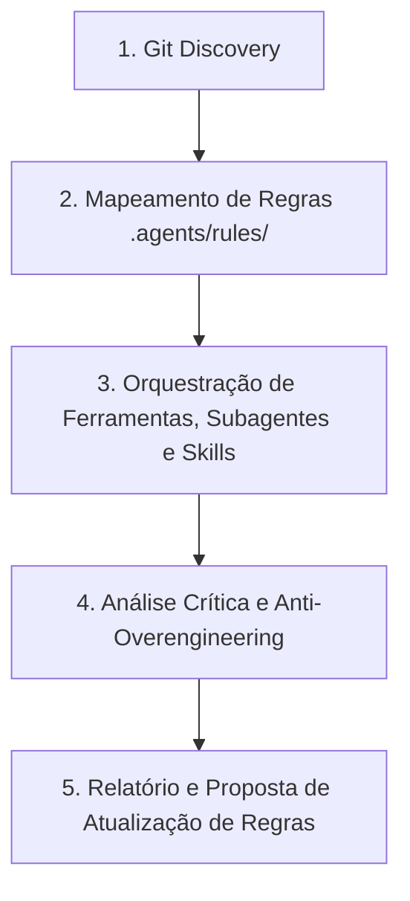

# Code Review & Quality Assurance

Runbook operacional para guiar o agente em uma revisão completa, aprofundada e factual de alterações produzidas na sessão atual ou durante o ciclo de trabalho, garantindo conformidade arquitetural, performance, testabilidade, simplicidade e melhoria contínua da governança.

## Como Usar
Invoque esta skill utilizando o comando:
```bash
/code-review
```

---

## Fluxo de Execução do Review



---

## 1. Descoberta de Arquivos Alterados (Git Discovery)

Mapear as alterações realizadas no repositório executando os comandos CLI com prefixo `rtk`:

```bash
rtk git log --since="today 00:00" --name-only --oneline
rtk git status
rtk git diff --name-only
```

Agrupar os arquivos identificados por camadas do Autogestor:
- **Domínio**: `src/Autogestor.Domain/**`
- **Aplicação**: `src/Autogestor.Application/**`
- **Infraestrutura**: `src/Autogestor.Infrastructure/**`
- **Contratos**: `src/Autogestor.Contract/**`
- **API**: `src/Autogestor.Api/**`
- **UI (RCL)**: `src/Autogestor.UI/**`
- **Web (WASM)**: `src/Autogestor.Web/**`
- **ServiceDefaults**: `src/Autogestor.ServiceDefaults/**`
- **Banco Nativo**: `db/**`
- **Projetos / Build**: `**/*.csproj`, `Directory.Build.*`, `Directory.Packages.props`, `*.slnx`
- **Testes**: `test/Autogestor.UnitTests/**`, `test/Autogestor.IntegrationTests/**`, `test/Autogestor.ArchitectureTests/**`

---

## 2. Verificação de Conformidade com as Regras do Projeto

Carregar e avaliar os arquivos alterados contra a totalidade das regras aplicáveis em [.agents/rules/](../../rules/):

1. **Identity & Multi-Tenancy**: Seguir integralmente [.agents/rules/identity-multitenancy.md](../../rules/identity-multitenancy.md).
2. **Convenções C#**: Seguir integralmente [.agents/rules/csharp-conventions.md](../../rules/csharp-conventions.md).
3. **Arquitetura**: Seguir integralmente [.agents/rules/architecture.md](../../rules/architecture.md).
4. **Contratos**: Seguir integralmente [.agents/rules/contracts-rules.md](../../rules/contracts-rules.md).
5. **Regras Específicas por Camada**: Seguir integralmente os arquivos correspondentes em `.agents/rules/` para cada camada modificada:
   - Domínio: [.agents/rules/domain-rules.md](../../rules/domain-rules.md)
   - Aplicação: [.agents/rules/application-rules.md](../../rules/application-rules.md)
   - Infraestrutura: [.agents/rules/infrastructure-rules.md](../../rules/infrastructure-rules.md)
   - API: [.agents/rules/api-rules.md](../../rules/api-rules.md)
   - UI (RCL): [.agents/rules/ui-rules.md](../../rules/ui-rules.md)
   - Web (WASM): [.agents/rules/web-rules.md](../../rules/web-rules.md)
   - ServiceDefaults: [.agents/rules/service-defaults-rules.md](../../rules/service-defaults-rules.md)
   - Banco de Dados: [.agents/rules/database-rules.md](../../rules/database-rules.md)
   - Testes Unitários: [.agents/rules/unit-testing-rules.md](../../rules/unit-testing-rules.md)
   - Testes de Integração: [.agents/rules/integration-testing-rules.md](../../rules/integration-testing-rules.md)
   - Testes de Arquitetura: [.agents/rules/architecture-testing-rules.md](../../rules/architecture-testing-rules.md)

---

## 3. Orquestração de Ferramentas Especializadas

Para cada categoria de arquivos afetados, acionar as ferramentas, subagentes, skills e servidores MCP correspondentes:

| Alvo / Camada | Recursos Disponíveis |
| :--- | :--- |
| **Código C# Geral (`.cs`)** | • Plugin `dotnet-diag`: subagente `optimizing-dotnet-performance`, skill `analyzing-dotnet-performance`<br>• Plugin `dotnet-upgrade`: skill `migrate-nullable-references` |
| **Contratos & gRPC (`Contract`)** | • Plugin `dotnet-upgrade`: skill `dotnet-aot-compat`<br>• Plugin `dotnet-test`: skill `assertion-quality`<br>• Plugin `dotnet-diag`: subagente `optimizing-dotnet-performance` |
| **Persistência / EF Core / SQL** | • Plugin `dotnet-data`: skill `optimizing-ef-core-queries`<br>• Submódulo `postgres-skills`: skill `postgres-best-practices`<br>• Submódulo `agent-skills`: skill `neon-postgres-egress-optimizer`, servidor MCP `neon` |
| **Projetos e MSBuild (`.csproj`)** | • Plugin `dotnet-msbuild`: subagentes `msbuild-code-review`, `build-perf`, `msbuild`; skills `msbuild-antipatterns`, `directory-build-organization`; servidor MCP `binlog`<br>• Plugin `dotnet-nuget`: skill `convert-to-cpm` |
| **Testes Unitários e Integração** | • Plugin `dotnet-test`: subagente `test-quality-auditor`; skills `test-anti-patterns`, `assertion-quality`, `test-gap-analysis`, `test-analysis-extensions`<br>• Plugin `dotnet-experimental`: skill `exp-mock-usage-analysis` |
| **APIs e Observabilidade** | • Plugin `dotnet-aspnetcore`: skills `dotnet-webapi`, `configuring-opentelemetry-dotnet`, `minimal-api-file-upload` |
| **Frontend Blazor (UI e Web)** | • Plugin `dotnet-blazor`: skills `author-component`, `collect-user-input`, `coordinate-components`, `support-prerendering`, `use-js-interop` |
| **Armazenamento e Cloud** | • Submódulo `agent-skills`: skills `neon-object-storage`, `neon-functions` |
| **Todo o Código Produzido** | • Submódulo `ponytail`: skills `ponytail-review`, `ponytail-audit`, `ponytail-gain` |

---

## 4. Avaliação Crítica e Classificação de Achados

Auditar o código de forma neutra e orientada aos fatos, categorizando cada achado:

### Classificação de Severidade
- 🚨 **Crítico**: Riscos de segurança, quebra de isolamento multi-tenant, corrupção de dados, falhas de compilação ou violação grave de fronteiras arquiteturais.
- ⚠️ **Importante**: Ineficiências de performance, gargalos de I/O, falhas de propagação de cancelamento, ausência de validação ou lacunas em testes.
- 💡 **Sugestão**: Complexidade acidental (over-engineering), código morto, oportunidades de simplificação ou alinhamento fino de estilo.

### Dimensões Obrigatórias de Avaliação
1. **Segurança & Multi-Tenancy**: Garantia do isolamento de dados entre clientes, consistência de contexto e autorização operacional.
2. **Performance & Recursos**: Eficiência no uso de memória, concorrência, operações assíncronas e persistência.
3. **Conformidade Arquitetural**: Aderência às fronteiras da Clean Architecture, modelagem de domínio, contratos e convenções de código.
4. **Qualidade e Cobertura de Testes**: Profundidade das asserções, cobertura de cenários de negócio e confiabilidade da suíte.
5. **Simplicidade & Manutenibilidade**: Identificação de abstrações prematuras, camadas desnecessárias ou código defensivo redundante.

### Formato Padronizado de Cada Achado
> **[Severidade] [Dimensão]** Título objetivo do achado
> - **Localização**: `caminho/do/arquivo:linha`
> - **Comportamento Atual**: Descrição factual do que foi implementado.
> - **Impacto / Risco Técnico**: Explicação do impacto em produção, manutenibilidade ou segurança.
> - **Ação Recomendada**: O que deve ser ajustado, acompanhado do trecho de código/diff sugerido.

---

## 5. Estrutura do Relatório de Fechamento

Ao concluir a análise, apresentar o relatório estruturado:

### 📋 1. Resumo do Trabalho da Sessão
- Lista concisa de features, correções ou refatorações desenvolvidas.
- Principais arquivos criados ou alterados agrupados por camada.

### ✅ 2. Pontos Positivos
- Destaques de boa arquitetura, conformidade com DDD, asserções de testes rigorosas e código limpo.

### ⚠️ 3. Oportunidades de Melhoria e Riscos Identificados (Acionáveis)
- Achados listados e categorizados conforme a classificação de severidade e dimensões obrigatórias.

### 💡 4. Sugestão de Atualização de Regras / Documentação (.agents)
- Se durante o review for identificado um padrão não documentado ou ambiguidade entre regras e implementação:
  - Apresentar a proposta de texto para inclusão ou edição no arquivo correspondente em `.agents/rules/`.
  - **Diretriz de Agnosticismo (Conformidade com [AGENTS.md](../../../AGENTS.md))**: As propostas de alteração documental e citações a regras devem ser **estritamente conceituais e agnósticas de código concreto e de recortes temáticos**. É expressamente proibido sugerir textos contendo menções a classes pontuais, métodos, propriedades, variáveis ou trechos de código específicos, bem como pré-filtrar ou enumerar subtemas em citações de regras. As propostas e referências devem expressar exclusivamente diretrizes macro, cumprimento integral de regras, fronteiras arquiteturais, semânticas de responsabilidade por camada e invariantes de governança, prevenindo o viés de confirmação ou visão de túnel (*tunnel vision*).
