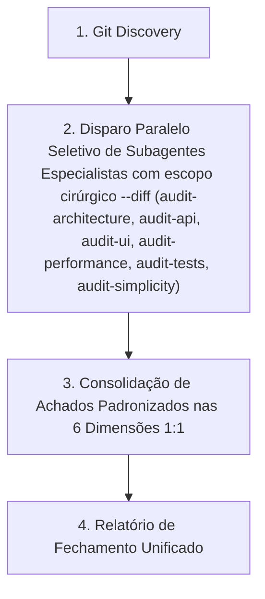

# Code Review & Quality Assurance (Orquestrador Puro)

Runbook operacional para atuar como meta-skill orquestradora de revisão de código no Autogestor. O orquestrador não realiza análises manuais diretas nem duplica avaliações; ele descobre os arquivos modificados, mapeia as camadas impactadas, dispara seletivamente e em paralelo os subagentes de auditoria especializada com escopo cirúrgico (`--diff`), consolida os achados padronizados e emite o relatório de fechamento unificado.

## Como Usar
Invoque esta skill utilizando o comando:
```bash
/code-review
```

---

## Fluxo de Execução do Review



---

## 1. Descoberta de Arquivos Alterados (Git Discovery)

Mapear as alterações realizadas no repositório executando exclusivamente comandos de leitura com prefixo `rtk`:

```bash
rtk git status
rtk git diff --name-only
rtk git log --since="today 00:00" --name-only --oneline
```

Agrupar os arquivos identificados por camadas do Autogestor:
- **Domínio**: `src/Autogestor.Domain/**`
- **Aplicação**: `src/Autogestor.Application/**`
- **Infraestrutura**: `src/Autogestor.Infrastructure/**`
- **Contratos**: `src/Autogestor.Contract/**`
- **API**: `src/Autogestor.Api/**`
- **UI (RCL)**: `src/Autogestor.UI/**`
- **Web (WASM)**: `src/Autogestor.Web/**`
- **ServiceDefaults**: `src/Autogestor.ServiceDefaults/**`
- **Banco Nativo**: `db/**`
- **Projetos / Build**: `**/*.csproj`, `Directory.Build.*`, `Directory.Packages.props`, `*.slnx`
- **Testes**: `test/Autogestor.UnitTests/**`, `test/Autogestor.IntegrationTests/**`, `test/Autogestor.ArchitectureTests/**`
- **Governança**: `.agents/**`, documentação

---

## 2. Mapeamento de Alvos e Disparo Seletivo em Paralelo

O orquestrador mapeia as camadas impactadas e dispara em paralelo os subagentes especializados com escopo cirúrgico `--diff`:

### Tabela de Mapeamento de Camadas e Skills Especializadas

| Alvo / Camada | Arquivos / Diretórios | Skills Especializadas Designadas |
| :--- | :--- | :--- |
| **Domínio e Aplicação** | `src/Autogestor.Domain/**`, `src/Autogestor.Application/**` | `/audit-architecture`, `/audit-performance`, `/audit-tests`, `/audit-simplicity` |
| **Infraestrutura e Persistência** | `src/Autogestor.Infrastructure/**`, `db/**` | `/audit-architecture`, `/audit-performance`, `/audit-tests`, `/audit-simplicity` |
| **Projetos e MSBuild** | `**/*.csproj`, `Directory.Build.*`, `Directory.Packages.props`, `*.slnx` | `/audit-architecture`, `/audit-simplicity` |
| **Contratos & gRPC** | `src/Autogestor.Contract/**` | `/audit-api`, `/audit-performance`, `/audit-tests`, `/audit-simplicity` |
| **APIs e Endpoints** | `src/Autogestor.Api/**` | `/audit-api`, `/audit-performance`, `/audit-tests`, `/audit-simplicity` |
| **ServiceDefaults & Observabilidade** | `src/Autogestor.ServiceDefaults/**` | `/audit-api`, `/audit-performance`, `/audit-tests`, `/audit-simplicity` |
| **Frontend Blazor (RCL e Web Host)** | `src/Autogestor.UI/**`, `src/Autogestor.Web/**` | `/audit-ui`, `/audit-performance`, `/audit-tests`, `/audit-simplicity` |
| **Suíte de Testes** | `test/**` | `/audit-tests`, `/audit-simplicity` |
| **Governança & Regras Gerais** | `.agents/**`, documentação | `/audit-architecture` |

### Disparo Seletivo de Subagentes Especialistas

O agente orquestrador mapeia os arquivos alterados no diff e aciona apenas os subagentes pertinentes com escopo cirúrgico `--diff`:

- **Auditoria de Arquitetura (`audit-architecture`)**: Disparado quando houver alterações em `Domain`, `Application`, `Infrastructure`, `db/`, projetos MSBuild (`.csproj`, `.props`, `.targets`, `.slnx`) ou governança arquitetural (`.agents/**`). Invocação cirúrgica: `/audit-architecture --diff [arquivos_alterados]`.
- **Auditoria de API (`audit-api`)**: Disparado quando houver alterações em contratos (`Contract`), serviços de API (`Api`) ou observabilidade/ServiceDefaults (`ServiceDefaults`). Invocação cirúrgica: `/audit-api --diff [arquivos_alterados]`.
- **Auditoria de UI (`audit-ui`)**: Disparado quando houver alterações em componentes Blazor (`UI`) ou no host WebAssembly (`Web`). Invocação cirúrgica: `/audit-ui --diff [arquivos_alterados]`.
- **Auditoria de Performance (`audit-performance`)**: Disparado quando houver alterações em C# de produção (`Domain`, `Application`, `Infrastructure`, `Contract`, `Api`, `UI`, `Web`, `ServiceDefaults`) ou persistência (`db/**`). Invocação cirúrgica: `/audit-performance --diff [arquivos_alterados]`.
- **Auditoria de Testes (`audit-tests`)**: Disparado quando houver alterações em projetos de testes (`test/**`) ou em código de produção (`src/**`). Invocação cirúrgica: `/audit-tests --diff [arquivos_alterados]`.
- **Auditoria de Simplicidade (`audit-simplicity`)**: Disparado para qualquer alteração de código na solução (produção, testes ou scripts). Invocação cirúrgica: `/audit-simplicity --diff [arquivos_alterados]`.

---

## 3. Consolidação de Achados Padronizados

Consolidar as respostas dos subagentes nas 6 dimensões padronizadas com simetria 1:1:

### Classificação de Severidade
- 🚨 **Crítico**: Riscos de segurança, quebra de isolamento multi-tenant, corrupção de dados, falhas de compilação ou regressões bloqueantes.
- ⚠️ **Importante**: Ineficiências de performance, quebra de contratos gRPC/API, divergências visuais de UI/MudTheme, gargalos de I/O, ausência de validação ou lacunas em testes.
- 💡 **Sugestão**: Complexidade acidental (over-engineering), código morto, oportunidades de simplificação ou alinhamento fino de estilo.

### Dimensões Obrigatórias de Avaliação (Simetria 1:1)
1. **[Arquitetura & Governança]**: Consolidada a partir do retorno de `audit-architecture`.
2. **[API & Contratos gRPC]**: Consolidada a partir do retorno de `audit-api`.
3. **[Interface & Componentes UI]**: Consolidada a partir do retorno de `audit-ui`.
4. **[Performance & Recursos]**: Consolidada a partir do retorno de `audit-performance`.
5. **[Qualidade e Cobertura de Testes]**: Consolidada a partir do retorno de `audit-tests`.
6. **[Simplicidade & Anti-Overengineering]**: Consolidada a partir do retorno de `audit-simplicity`.

### Formato Padronizado de Cada Achado (Contrato de Achados)
> **[Severidade] [Dimensão]** Título objetivo do achado
> - **Localização**: `caminho/do/arquivo:linha`
> - **Comportamento Atual**: Descrição factual do que foi implementado.
> - **Impacto / Risco Técnico**: Explicação do impacto em produção, manutenibilidade, conformidade ou segurança.
> - **Ação Recomendada**: O que deve ser ajustado, acompanhado do trecho de código/diff sugerido.

---

## 4. Estrutura do Relatório de Fechamento Unificado

Ao consolidar os achados de todos os subagentes especializados disparados, apresentar o relatório unificado:

### 📋 1. Resumo do Trabalho da Sessão
- Lista concisa de features, correções ou refatorações desenvolvidas.
- Principais arquivos criados ou alterados agrupados por camada.
- Síntese executiva consolidada dos subagentes especializados disparados (`audit-architecture`, `audit-api`, `audit-ui`, `audit-performance`, `audit-tests`, `audit-simplicity`).

### ✅ 2. Pontos Positivos
- Destaques concisos e objetivo de conformidade arquitetural, contratos gRPC, fidelidade visual Blazor/MudTheme, isolamento multi-tenant, simplicidade, eficiência de máquina e saúde de testes.

### ⚠️ 3. Oportunidades de Melhoria e Riscos Identificados (Acionáveis)
- Achados consolidados categorizados conforme a classificação de severidade e as 6 dimensões obrigatórias de avaliação.

### 💡 4. Sugestão de Atualização de Regras / Documentação (.agents)
- Se durante o review for identificado um padrão não documentado ou ambiguidade entre regras e implementação:
  - Apresentar a proposta de texto para inclusão ou edição no arquivo correspondente em `.agents/rules/`.
  - **Diretriz de Agnosticismo (Conformidade com [AGENTS.md](../../../AGENTS.md))**: As propostas de alteração documental e citações a regras devem ser **estritamente conceituais e agnósticas de código concreto e de recortes temáticos**. É expressamente proibido sugerir textos contendo menções a classes pontuais, métodos, propriedades, variáveis ou trechos de código específicos, bem como pré-filtrar ou enumerar subtemas em citações de regras. As propostas e referências devem expressar exclusivamente diretrizes macro, cumprimento integral de regras, fronteiras arquiteturais, semânticas de responsabilidade por camada e invariantes de governança, prevenindo o viés de confirmação ou visão de túnel (*tunnel vision*).
