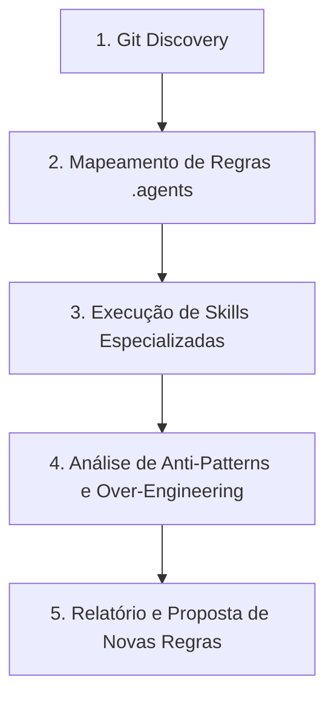

# Daily Code Review & Quality Assurance

Esta skill orienta a realização de uma revisão completa e aprofundada de tudo o que foi produzido no dia de trabalho ou na sessão atual, garantindo a conformidade arquitetural, performance, testabilidade e a melhoria contínua da documentação do projeto.

---

## Fluxo de Execução do Review



---

## 1. Descoberta de Arquivos Alterados (Git Discovery)

O agente deve mapear todas os arquivos com alterações realizadas no dia:

**Commits realizados no dia (Sessão de Trabalho)**:
   ```bash
   git log --since="today 00:00" --name-only --oneline
   ```

Agrupar os arquivos identificados por camadas:
- **Domínio**: `src/Autogestor.Domain/**`
- **Aplicação**: `src/Autogestor.Application/**`
- **Infraestrutura**: `src/Autogestor.Infrastructure/**`
- **Contratos**: `src/Autogestor.Contract/**`
- **API**: `src/Autogestor.Api/**`
- **UI**: `src/Autogestor.UI/**`
- **Web**: `src/Autogestor.Web/**`
- **Banco Nativo**: `db/**`
- **Projetos / Build**: `**/*.csproj`, `Directory.Build.*`, `*.slnx`
- **Testes**: `test/**`

---

## 2. Verificação de Conformidade com as Regras do Projeto

Validar os arquivos alterados contra as regras de [.agents/rules/](../rules/):

1. **Multi-Tenancy e Segurança ([identity-multitenancy.md](../rules/identity-multitenancy.md))**
2. **Padrões de Código C# ([csharp-conventions.md](../rules/csharp-conventions.md))**
3. **Fronteiras de Dependência ([architecture.md](../rules/architecture.md))**
4. **Contratos gRPC ([grpc-contracts.md](../rules/grpc-contracts.md))**

---

## 3. Orquestração de Skills Especializadas

Para cada conjunto de arquivos afetados, invocar as regras e ferramentas especializadas:

| Tipo de Arquivo / Alvo | Skill Especializada a Executar |
| :--- | :--- |
| **Código C# Geral (`.cs`)** | `analyzing-dotnet-performance` |
| **Persistência / EF Core** | `optimizing-ef-core-queries` |
| **Projetos e MSBuild (`.csproj`)** | `msbuild-antipatterns` |
| **Testes Unitários / Integração** | `test-anti-patterns` |
| **Todo o Código Produzido** | `ponytail-review` |

---

## 4. Estrutura do Relatório de Fechamento

Ao concluir a análise, apresentar o resultado estruturado:

### 📋 1. Resumo do Trabalho do Dia
- Lista concisa de features, correções ou refatorações desenvolvidas.
- Arquivos chave criados ou alterados.

### ✅ 2. Pontos Positivos
- Lista concisa de destaques de boa arquitetura, conformidade com DDD, testes e código limpo.

### ⚠️ 3. Oportunidades de Melhoria e Riscos Identificados (Acionáveis)

O agente deve auditar o código alterado de forma neutra e orientada aos fatos, categorizando cada achado real nas dimensões abaixo e classificando por severidade. Se uma dimensão não apresentar inconformidades, ela deve ser omitida ou declarada como em conformidade.

#### Classificação de Severidade
- 🚨 **Crítico**: Riscos de segurança, quebra de isolamento multi-tenant, corrupção/vazamento de dados, falhas de compilação ou violação grave de fronteiras arquiteturais.
- ⚠️ **Importante**: Ineficiências de performance, gargalos de I/O, falhas de propagação de cancelamento, ausência de validação ou lacunas em testes.
- 💡 **Sugestão**: Complexidade acidental (over-engineering), código morto, oportunidades de simplificação ou alinhamento fino de estilo.

#### Dimensões Obrigatórias de Avaliação
1. **Segurança & Multi-Tenancy**: Garantia do isolamento de dados entre empresas, consistência de contexto de tenant e validações de autorização operacional.
2. **Performance & Recursos**: Eficiência no uso de memória (Heap/GC), operações de I/O assíncronas, propagação de `CancellationToken` e eficiência em persistência de dados.
3. **Conformidade Arquitetural (.agents)**: Aderência rigorosa às regras de Clean Architecture, DDD, tipagem forte, imutabilidade e contratos gRPC definidos no projeto.
4. **Qualidade e Cobertura de Testes**: Profundidade das asserções, cobertura de caminhos críticos/bordas e fidelidade dos cenários de teste.
5. **Simplicidade & Manutenibilidade (Ponytail)**: Identificação de abstrações prematuras, camadas desnecessárias ou redundâncias.

#### Formato Padronizado de Cada Item Reportado
Para cada oportunidade de melhoria identificada, reportar estritamente no seguinte formato:

> **[Severidade] [Dimensão]** Título objetivo do achado
> - **Localização**: `caminho/do/arquivo:linha`
> - **Comportamento Atual**: Descrição factual do que foi implementado.
> - **Impacto / Risco Técnico**: Explicação do impacto em produção, manutenibilidade ou segurança.
> - **Ação Recomendada**: O que deve ser ajustado, acompanhado do trecho de código/diff sugerido.

### 💡 4. Sugestão de Atualização de Regras / Documentação (.agents)
- Se durante o review for identificado:
  - Um novo padrão adotado na solução que ainda **não está documentado** nos `.md`.
  - Uma ambiguidade entre o que as regras pedem e o que a solução precisa.
- **Apresentar a proposta de texto exata** para inclusão/edição no arquivo correspondente em `.agents/rules/`.
