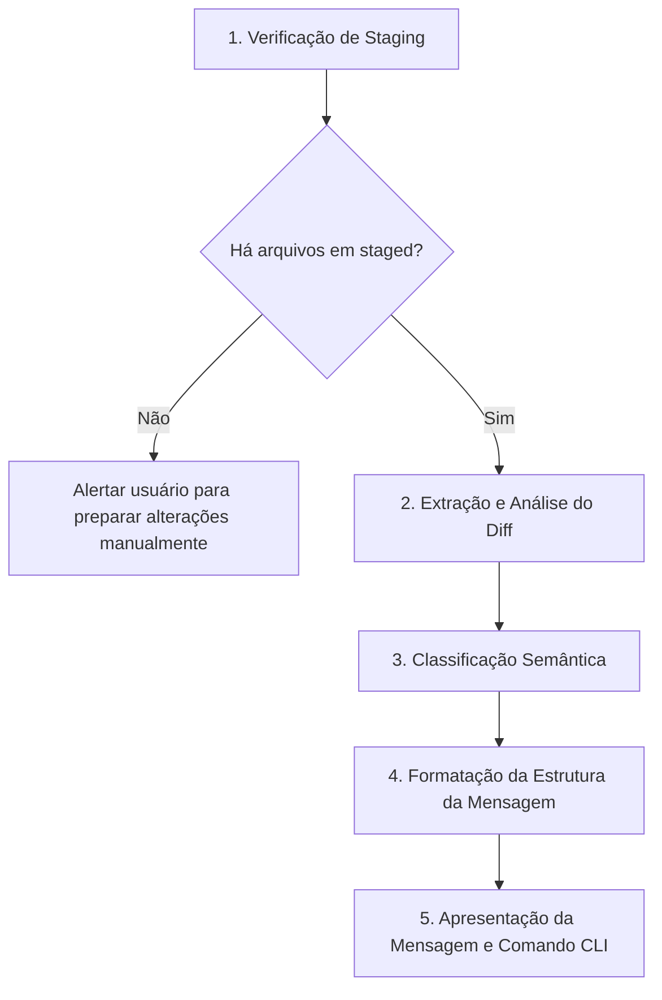

# Elaboração de Mensagem de Commit (Commit)

Runbook operacional para guiar o agente na inspeção detalhada de alterações preparadas para commit (staging area), classificação semântica das mudanças segundo Conventional Commits, definição da estrutura exata e redação em português brasileiro (pt-BR).

## Como Usar
Invoque esta skill utilizando o comando:
```bash
/commit
```
Ou quando o usuário solicitar explicitamente uma mensagem de commit (ex: *"me dê a mensagem de commit"*, *"qual mensagem de commit para essas alterações?"*).

---

## Fluxo de Execução



---

## 1. Verificação de Arquivos em Staged

Inspecionar o estado da árvore de trabalho e identificar os arquivos preparados na staging area utilizando os comandos CLI com prefixo `rtk`:

```bash
rtk git status --short
rtk git diff --cached --name-only
```

> [!IMPORTANT]
> **Bloqueio de Staging Vazio**: Se nenhum arquivo estiver preparado na staging area (`rtk git diff --cached --name-only` retornar vazio):
> 1. Interromper o processo imediatamente.
> 2. Informar ao usuário que é necessário preparar as alterações desejadas (`git add <arquivos>`) antes de gerar a mensagem.
> 3. Em conformidade estrita com [.agents/rules/git.md](../../rules/git.md), o agente **nunca** deve executar `git add`, `git commit` ou `git push`.

---

## 2. Extração e Análise do Diff Preparado

Extrair as alterações detalhadas dos arquivos em staging para compreender a intenção e o escopo da mudança:

```bash
rtk git diff --cached
```

O agente deve analisar o diff respondendo às seguintes perguntas:
- **Qual é o propósito primário da mudança?** (Uma correção de bug, uma nova funcionalidade, uma refatoração estrutural, ajuste de build ou testes?)
- **Quais camadas do sistema foram impactadas?** (Domínio, Aplicação, Infraestrutura, Contratos, UI, Configurações, Documentação, etc.)
- **A mudança é atômica ou transversal?** (Afeta um único fluxo ou múltiplos componentes coordenados?)

---

## 3. Classificação Semântica (Tipos Padronizados)

Determinar o tipo semântico exato da alteração:

| Tipo | Finalidade e Escopo |
| :--- | :--- |
| `feat` | Nova funcionalidade, novo endpoint, novo caso de uso, nova regra de negócio ou nova capacidade de domínio. |
| `fix` | Correção de bug, falha de validação, erro de concorrência ou comportamento incorreto. |
| `refactor` | Reestruturação de código interno sem alteração de comportamento observável ou regras de negócio. |
| `test` | Criação, expansão, refatoração ou correção de testes (unitários, integração ou arquitetura). |
| `docs` | Alterações exclusivas em documentação, arquivos markdown, regras em `.agents/` ou diagramas. |
| `chore` | Manutenção de build, scripts, configurações de ambiente, atualização de dependências ou automações. |

---

## 4. Estrutura Exata da Mensagem de Commit

A mensagem devolvida deve seguir rigorosamente a estrutura abaixo:

```text
<tipo>: <descrição de 128 a 256 caracteres>
```

### Regras de Redação
1. **Idioma**: Estritamente em **português brasileiro (pt-BR)** com ortografia e acentuação corretas.
2. **Descrição Concisa**: 128 a 256 caracteres, iniciado em minúscula logo após o `<tipo>: `, sem ponto final.
3. **Tom do Verbo**: Utilizar verbo no indicativo objetivo ou imperativo claro (ex: `adiciona`, `corrige`, `refatora`, `ajusta`, `remove`).

---

## 5. Formato Padronizado de Devolução ao Usuário

Ao concluir a análise, o agente deve apresentar a resposta com a mensagem formatada:

```markdown
`tipo: descrição`
```
