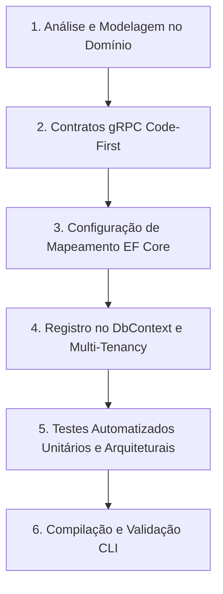

# Propagação de Domínio (Propagate Domain)

Runbook operacional para guiar a propagação consistente de uma entidade de domínio através de todas as camadas impactadas da solução: contratos gRPC Code-First, infraestrutura de persistência no EF Core, isolamento multi-tenant e suíte de testes automatizados.

## Como Usar
Invoque esta skill utilizando o comando:
```bash
/propagate-domain [NomeDaEntidade]
```

---

## Fluxo de Execução



---

## 1. Análise e Modelagem da Entidade de Domínio

- **Localização**: `src/Autogestor.Domain/Entities/[NomeDaEntidade].cs`
- **Regras Aplicáveis**:
  - [.agents/rules/domain-rules.md](../../rules/domain-rules.md)
  - [.agents/rules/architecture.md](../../rules/architecture.md)
  - [.agents/rules/csharp-conventions.md](../../rules/csharp-conventions.md)
- **Ferramentas por Origem e Plugin**:
  - Submódulo `ponytail`: skill `ponytail`
  - Plugin `dotnet-diag`: subagente `optimizing-dotnet-performance`, skill `analyzing-dotnet-performance`
- **Diretrizes de Orquestração**:
  - Modelar a entidade em conformidade estrita com [.agents/rules/domain-rules.md](../../rules/domain-rules.md).
  - Consultar e seguir integralmente [.agents/rules/architecture.md](../../rules/architecture.md) e [.agents/rules/csharp-conventions.md](../../rules/csharp-conventions.md).

---

## 2. Propagação e Modelagem de Contratos gRPC (Autogestor.Contract)

- **Localização**:
  - `src/Autogestor.Contract/Responses/[Feature]/[NomeDaEntidade]Response.cs`
  - `src/Autogestor.Contract/Requests/[Feature]/`
  - `src/Autogestor.Contract/Services/I[Feature]Service.cs`
- **Regras Aplicáveis**:
  - [.agents/rules/contracts-rules.md](../../rules/contracts-rules.md)
  - [.agents/rules/architecture.md](../../rules/architecture.md)
  - [.agents/rules/csharp-conventions.md](../../rules/csharp-conventions.md)
- **Ferramentas por Origem e Plugin**:
  - Plugin `dotnet-upgrade`: skill `dotnet-aot-compat`
  - Plugin `dotnet-diag`: subagente `optimizing-dotnet-performance`, skill `analyzing-dotnet-performance`
  - Submódulo `ponytail`: skill `ponytail`
- **Diretrizes de Orquestração**:
  - Modelar os contratos e interfaces de serviço em conformidade estrita com [.agents/rules/contracts-rules.md](../../rules/contracts-rules.md).
  - Consultar e seguir integralmente [.agents/rules/architecture.md](../../rules/architecture.md) e [.agents/rules/csharp-conventions.md](../../rules/csharp-conventions.md).

---

## 3. Configuração de Mapeamento e Persistência (EF Core)

- **Localização**: `src/Autogestor.Infrastructure/Persistence/Configurations/[NomeDaEntidade]Configuration.cs`
- **Regras Aplicáveis**:
  - [.agents/rules/infrastructure-rules.md](../../rules/infrastructure-rules.md)
  - [.agents/rules/database-rules.md](../../rules/database-rules.md)
- **Ferramentas por Origem e Plugin**:
  - Plugin `dotnet-data`: skill `optimizing-ef-core-queries`
  - Submódulo `postgres-skills`: skill `postgres-best-practices`
  - Submódulo `agent-skills`: servidor MCP `neon`
- **Diretrizes de Orquestração**:
  - Implementar a configuração de mapeamento em conformidade estrita com [.agents/rules/infrastructure-rules.md](../../rules/infrastructure-rules.md).
  - Consultar e seguir integralmente [.agents/rules/database-rules.md](../../rules/database-rules.md).

---

## 4. Registro no DbContext e Isolamento Multi-Tenancy

- **Localização**: `src/Autogestor.Infrastructure/Persistence/AppDbContext.cs`
- **Regras Aplicáveis**:
  - [.agents/rules/infrastructure-rules.md](../../rules/infrastructure-rules.md)
  - [.agents/rules/identity-multitenancy.md](../../rules/identity-multitenancy.md)
- **Ferramentas por Origem e Plugin**:
  - Plugin `dotnet-data`: skill `optimizing-ef-core-queries`
  - Submódulo `agent-skills`: servidor MCP `neon`
- **Diretrizes de Orquestração**:
  - Configurar o `AppDbContext` em conformidade estrita com [.agents/rules/infrastructure-rules.md](../../rules/infrastructure-rules.md).
  - Consultar e seguir integralmente [.agents/rules/identity-multitenancy.md](../../rules/identity-multitenancy.md).

---

## 5. Escrita e Auditoria dos Testes Automatizados

- **Localização**:
  - `test/Autogestor.UnitTests/Domain/Entities/[NomeDaEntidade]Tests.cs`
  - `test/Autogestor.UnitTests/Contract/Responses/[Feature]/[NomeDaEntidade]ResponseTests.cs`
  - `test/Autogestor.ArchitectureTests/ContractArchitectureTests.cs`
- **Regras Aplicáveis**:
  - [.agents/rules/unit-testing-rules.md](../../rules/unit-testing-rules.md)
  - [.agents/rules/architecture-testing-rules.md](../../rules/architecture-testing-rules.md)
  - [.agents/rules/csharp-conventions.md](../../rules/csharp-conventions.md)
  - [AGENTS.md](../../../AGENTS.md)
- **Ferramentas por Origem e Plugin**:
  - Plugin `dotnet-test`: subagente `test-quality-auditor`, skills `assertion-quality`, `test-anti-patterns`, `test-gap-analysis`
- **Diretrizes de Orquestração**:
  - Implementar os testes unitários em conformidade estrita com [.agents/rules/unit-testing-rules.md](../../rules/unit-testing-rules.md).
  - Implementar os testes de arquitetura em conformidade estrita com [.agents/rules/architecture-testing-rules.md](../../rules/architecture-testing-rules.md).
  - Consultar e seguir integralmente [.agents/rules/csharp-conventions.md](../../rules/csharp-conventions.md) e [AGENTS.md](../../../AGENTS.md).

---

## 6. Compilação e Validação da Solução

Executar a compilação e a suíte de testes utilizando o proxy `rtk`:

```bash
rtk dotnet build Autogestor.slnx
rtk dotnet test
```

Em caso de falhas de compilação:
- Acionar os recursos do plugin `dotnet-msbuild`: subagente `msbuild`, skill `binlog-failure-analysis` e servidor MCP `binlog`.
