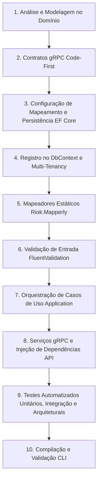

# Propagação de Domínio (Propagate Domain)

Runbook operacional para guiar a propagação consistente de uma entidade de domínio através de todas as camadas impactadas da solução: contratos gRPC Code-First, persistência no EF Core, isolamento multi-tenant, mapeamentos em tempo de compilação com Riok.Mapperly, validações de entrada com FluentValidation, orquestração de casos de uso na camada Application, exposição de serviços gRPC com injeção de dependências tipada na API e suíte abrangente de testes automatizados.

## Como Usar
Invoque esta skill utilizando o comando:
```bash
/propagate-domain [NomeDaEntidade]
```

---

## Fluxo de Execução



---

## 1. Análise e Modelagem da Entidade de Domínio

- **Localização**:
  - `src/Autogestor.Domain/Entities/[NomeDaEntidade].cs`
  - `src/Autogestor.Domain/Interfaces/I[NomeDaEntidade]Repository.cs`
  - `src/Autogestor.Domain/Exceptions/[NomeDaEntidade]...Exception.cs`
- **Regras Aplicáveis**:
  - [.agents/rules/domain-rules.md](../../rules/domain-rules.md)
  - [.agents/rules/architecture.md](../../rules/architecture.md)
  - [.agents/rules/csharp-conventions.md](../../rules/csharp-conventions.md)
- **Ferramentas por Origem e Plugin**:
  - Submódulo `ponytail`: skill `ponytail`
  - Plugin `dotnet-diag`: subagente `optimizing-dotnet-performance`, skill `analyzing-dotnet-performance`
- **Diretrizes de Orquestração**:
  - Modelar a entidade, interfaces de repositório e exceções de domínio em conformidade estrita com [.agents/rules/domain-rules.md](../../rules/domain-rules.md).
  - Consultar e seguir integralmente [.agents/rules/architecture.md](../../rules/architecture.md) e [.agents/rules/csharp-conventions.md](../../rules/csharp-conventions.md).

---

## 2. Propagação e Modelagem de Contratos gRPC (Autogestor.Contract)

- **Localização**:
  - `src/Autogestor.Contract/Responses/[Feature]/[NomeDaEntidade]Response.cs`
  - `src/Autogestor.Contract/Requests/[Feature]/Create[NomeDaEntidade]Request.cs`
  - `src/Autogestor.Contract/Requests/[Feature]/Update[NomeDaEntidade]Request.cs`
  - `src/Autogestor.Contract/Requests/[Feature]/`
  - `src/Autogestor.Contract/Services/I[Feature]Service.cs`
- **Regras Aplicáveis**:
  - [.agents/rules/contracts-rules.md](../../rules/contracts-rules.md)
  - [.agents/rules/architecture.md](../../rules/architecture.md)
  - [.agents/rules/csharp-conventions.md](../../rules/csharp-conventions.md)
- **Ferramentas por Origem e Plugin**:
  - Plugin `dotnet-upgrade`: skill `dotnet-aot-compat`
  - Plugin `dotnet-diag`: subagente `optimizing-dotnet-performance`, skill `analyzing-dotnet-performance`
  - Submódulo `ponytail`: skill `ponytail`
- **Diretrizes de Orquestração**:
  - Modelar os contratos de requisição/resposta e interfaces de serviço gRPC Code-First em conformidade estrita com [.agents/rules/contracts-rules.md](../../rules/contracts-rules.md).
  - Consultar e seguir integralmente [.agents/rules/architecture.md](../../rules/architecture.md) e [.agents/rules/csharp-conventions.md](../../rules/csharp-conventions.md).

---

## 3. Configuração de Mapeamento e Persistência (EF Core)

- **Localização**:
  - `src/Autogestor.Infrastructure/Persistence/Configurations/[NomeDaEntidade]Configuration.cs`
  - `src/Autogestor.Infrastructure/Persistence/Repositories/[NomeDaEntidade]Repository.cs`
- **Regras Aplicáveis**:
  - [.agents/rules/infrastructure-rules.md](../../rules/infrastructure-rules.md)
  - [.agents/rules/database-rules.md](../../rules/database-rules.md)
- **Ferramentas por Origem e Plugin**:
  - Plugin `dotnet-data`: skill `optimizing-ef-core-queries`
  - Submódulo `postgres-skills`: skill `postgres-best-practices`
  - Submódulo `agent-skills`: servidor MCP `neon`
- **Diretrizes de Orquestração**:
  - Implementar a configuração de mapeamento e a classe concreta de repositório em conformidade estrita com [.agents/rules/infrastructure-rules.md](../../rules/infrastructure-rules.md).
  - Consultar e seguir integralmente [.agents/rules/database-rules.md](../../rules/database-rules.md).

---

## 4. Registro no DbContext e Isolamento Multi-Tenancy

- **Localização**: `src/Autogestor.Infrastructure/Persistence/AppDbContext.cs`
- **Regras Aplicáveis**:
  - [.agents/rules/infrastructure-rules.md](../../rules/infrastructure-rules.md)
  - [.agents/rules/identity-multitenancy.md](../../rules/identity-multitenancy.md)
- **Ferramentas por Origem e Plugin**:
  - Plugin `dotnet-data`: skill `optimizing-ef-core-queries`
  - Submódulo `agent-skills`: servidor MCP `neon`
- **Diretrizes de Orquestração**:
  - Configurar o `AppDbContext` em conformidade estrita com [.agents/rules/infrastructure-rules.md](../../rules/infrastructure-rules.md).
  - Consultar e seguir integralmente [.agents/rules/identity-multitenancy.md](../../rules/identity-multitenancy.md).

---

## 5. Mapeadores Estáticos em Tempo de Compilação com Riok.Mapperly (Autogestor.Application)

- **Localização**: `src/Autogestor.Application/Mappers/[NomeDaEntidade]Mapper.cs`
- **Regras Aplicáveis**:
  - [.agents/rules/application-rules.md](../../rules/application-rules.md)
  - [.agents/rules/architecture.md](../../rules/architecture.md)
  - [.agents/rules/csharp-conventions.md](../../rules/csharp-conventions.md)
- **Ferramentas por Origem e Plugin**:
  - Plugin `dotnet-upgrade`: skill `dotnet-aot-compat`
  - Plugin `dotnet-diag`: subagente `optimizing-dotnet-performance`, skill `analyzing-dotnet-performance`
  - Submódulo `ponytail`: skill `ponytail`
- **Diretrizes de Orquestração**:
  - Implementar classes estáticas de mapeamento com geração em tempo de compilação em conformidade estrita com [.agents/rules/application-rules.md](../../rules/application-rules.md).
  - Consultar e seguir integralmente [.agents/rules/architecture.md](../../rules/architecture.md) e [.agents/rules/csharp-conventions.md](../../rules/csharp-conventions.md).

---

## 6. Validação de Entrada com FluentValidation (Autogestor.Application)

- **Localização**: `src/Autogestor.Application/Validators/[Feature]/[Acao][NomeDaEntidade]RequestValidator.cs`
- **Regras Aplicáveis**:
  - [.agents/rules/application-rules.md](../../rules/application-rules.md)
  - [.agents/rules/architecture.md](../../rules/architecture.md)
  - [.agents/rules/csharp-conventions.md](../../rules/csharp-conventions.md)
- **Ferramentas por Origem e Plugin**:
  - Plugin `dotnet-upgrade`: skill `dotnet-aot-compat`
  - Plugin `dotnet-test`: subagente `test-quality-auditor`, skill `assertion-quality`
  - Submódulo `ponytail`: skill `ponytail`
- **Diretrizes de Orquestração**:
  - Implementar validadores de entrada fortemente tipados em conformidade estrita com [.agents/rules/application-rules.md](../../rules/application-rules.md).
  - Consultar e seguir integralmente [.agents/rules/architecture.md](../../rules/architecture.md) e [.agents/rules/csharp-conventions.md](../../rules/csharp-conventions.md).

---

## 7. Orquestração de Casos de Uso (Autogestor.Application)

- **Localização**:
  - `src/Autogestor.Application/UseCases/[Feature]/Commands/`
  - `src/Autogestor.Application/UseCases/[Feature]/Queries/`
- **Regras Aplicáveis**:
  - [.agents/rules/application-rules.md](../../rules/application-rules.md)
  - [.agents/rules/identity-multitenancy.md](../../rules/identity-multitenancy.md)
  - [.agents/rules/architecture.md](../../rules/architecture.md)
  - [.agents/rules/csharp-conventions.md](../../rules/csharp-conventions.md)
- **Ferramentas por Origem e Plugin**:
  - Plugin `dotnet-diag`: subagente `optimizing-dotnet-performance`, skill `analyzing-dotnet-performance`
  - Plugin `dotnet-test`: subagente `test-quality-auditor`, skills `test-anti-patterns`, `assertion-quality`, `test-gap-analysis`
  - Plugin `dotnet-experimental`: skill `exp-mock-usage-analysis`
  - Submódulo `ponytail`: skills `ponytail`, `ponytail-review`
- **Diretrizes de Orquestração**:
  - Implementar os casos de uso para comandos e consultas em conformidade estrita com [.agents/rules/application-rules.md](../../rules/application-rules.md).
  - Consultar e seguir integralmente [.agents/rules/identity-multitenancy.md](../../rules/identity-multitenancy.md), [.agents/rules/architecture.md](../../rules/architecture.md) e [.agents/rules/csharp-conventions.md](../../rules/csharp-conventions.md).

---

## 8. Serviço gRPC e Injeção de Dependências Tipada (Autogestor.Api)

- **Localização**:
  - `src/Autogestor.Api/Services/[Feature]Service.cs`
  - `src/Autogestor.Api/Extensions/BuilderExtensions.cs`
- **Regras Aplicáveis**:
  - [.agents/rules/api-rules.md](../../rules/api-rules.md)
  - [.agents/rules/identity-multitenancy.md](../../rules/identity-multitenancy.md)
  - [.agents/rules/architecture.md](../../rules/architecture.md)
  - [.agents/rules/csharp-conventions.md](../../rules/csharp-conventions.md)
- **Ferramentas por Origem e Plugin**:
  - Plugin `dotnet-aspnetcore`: skills `dotnet-webapi`, `configuring-opentelemetry-dotnet`
  - Plugin `dotnet-diag`: subagente `optimizing-dotnet-performance`, skill `analyzing-dotnet-performance`
  - Plugin `dotnet-upgrade`: skill `dotnet-aot-compat`
  - Submódulo `ponytail`: skill `ponytail`
- **Diretrizes de Orquestração**:
  - Implementar a classe de serviço gRPC em conformidade estrita com [.agents/rules/api-rules.md](../../rules/api-rules.md).
  - Registrar explicitamente os serviços gRPC, casos de uso e validadores no contêiner de injeção de dependências em `src/Autogestor.Api/Extensions/BuilderExtensions.cs` em conformidade com [.agents/rules/api-rules.md](../../rules/api-rules.md) e [.agents/rules/identity-multitenancy.md](../../rules/identity-multitenancy.md).
  - Consultar e seguir integralmente [.agents/rules/architecture.md](../../rules/architecture.md) e [.agents/rules/csharp-conventions.md](../../rules/csharp-conventions.md).

---

## 9. Escrita e Auditoria dos Testes Automatizados

- **Localização**:
  - `test/Autogestor.UnitTests/Domain/Entities/[NomeDaEntidade]Tests.cs`
  - `test/Autogestor.UnitTests/Contract/Responses/[Feature]/[NomeDaEntidade]ResponseTests.cs`
  - `test/Autogestor.UnitTests/Application/Mappers/[NomeDaEntidade]MapperTests.cs`
  - `test/Autogestor.UnitTests/Application/Validators/[Feature]/[Acao][NomeDaEntidade]RequestValidatorTests.cs`
  - `test/Autogestor.UnitTests/Application/UseCases/[Feature]/`
  - `test/Autogestor.UnitTests/Api/Services/[Feature]ServiceTests.cs`
  - `test/Autogestor.IntegrationTests/Persistence/[NomeDaEntidade]RepositoryTests.cs`
  - `test/Autogestor.IntegrationTests/Services/[Feature]ServiceTests.cs`
  - `test/Autogestor.ArchitectureTests/LayersTests.cs`
  - `test/Autogestor.ArchitectureTests/ContractArchitectureTests.cs`
  - `test/Autogestor.ArchitectureTests/ExceptionArchitectureTests.cs`
- **Regras Aplicáveis**:
  - [.agents/rules/unit-testing-rules.md](../../rules/unit-testing-rules.md)
  - [.agents/rules/integration-testing-rules.md](../../rules/integration-testing-rules.md)
  - [.agents/rules/architecture-testing-rules.md](../../rules/architecture-testing-rules.md)
  - [.agents/rules/csharp-conventions.md](../../rules/csharp-conventions.md)
  - [AGENTS.md](../../../AGENTS.md)
- **Ferramentas por Origem e Plugin**:
  - Plugin `dotnet-test`: subagente `test-quality-auditor`, skills `assertion-quality`, `test-anti-patterns`, `test-gap-analysis`, `find-untested-sources`, `coverage-analysis`, `crap-score`
  - Plugin `dotnet-experimental`: skills `exp-mock-usage-analysis`, `exp-test-maintainability`
  - Plugin `dotnet-data`: skill `optimizing-ef-core-queries`
  - Submódulo `postgres-skills`: skill `postgres-best-practices`
  - Submódulo `agent-skills`: skill `neon-postgres-branches`, servidor MCP `neon`
  - Submódulo `ponytail`: skill `ponytail`
- **Diretrizes de Orquestração**:
  - Implementar testes unitários em conformidade estrita com [.agents/rules/unit-testing-rules.md](../../rules/unit-testing-rules.md).
  - Implementar testes de integração em conformidade estrita com [.agents/rules/integration-testing-rules.md](../../rules/integration-testing-rules.md).
  - Implementar e verificar asserções de arquitetura em conformidade estrita com [.agents/rules/architecture-testing-rules.md](../../rules/architecture-testing-rules.md).
  - Consultar e seguir integralmente [.agents/rules/csharp-conventions.md](../../rules/csharp-conventions.md) e [AGENTS.md](../../../AGENTS.md).

---

## 10. Compilação e Validação da Solução

Executar a compilação e a suíte completa de testes utilizando o proxy `rtk`:

```bash
rtk dotnet build Autogestor.slnx
rtk dotnet test --solution Autogestor.slnx
```

- **Regras Aplicáveis**:
  - [.agents/rules/rtk-rules.md](../../rules/rtk-rules.md)
  - [.agents/rules/architecture.md](../../rules/architecture.md)
- **Ferramentas por Origem e Plugin**:
  - Plugin `dotnet-msbuild`: subagente `msbuild`, subagente `msbuild-code-review`, skills `binlog-failure-analysis`, `binlog-generation`, servidor MCP `binlog`
- **Diretrizes de Orquestração**:
  - Assegurar compilação com zero erros e zero advertências (`<TreatWarningsAsErrors>true</TreatWarningsAsErrors>`).
  - Em caso de falhas ou degradação de build, acionar os recursos diagnósticos do plugin `dotnet-msbuild` e consultar [.agents/rules/rtk-rules.md](../../rules/rtk-rules.md).
