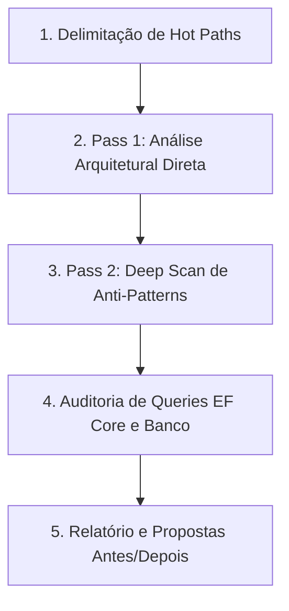

# Workflow: Auditoria de Performance (Audit Performance)

Workflow especializado para guiar a IA na identificação, diagnóstico e resolução de gargalos de performance, alocações excessivas no heap, ineficiências em async/await, overhead de queries no EF Core e preparação para compilação AOT no ecossistema do Autogestor.

## Como Usar
Invoque este workflow utilizando o comando:
```bash
/audit-performance [caminho_ou_camada_opcional]
```
Exemplos:
- `/audit-performance` (audita toda a solução focando nos fluxos críticos)
- `/audit-performance src/Autogestor.Application` (audita orquestrações de casos de uso e handlers MediatR)
- `/audit-performance src/Autogestor.Infrastructure` (audita consultas EF Core, repositórios e interceptadores)
- `/audit-performance src/Autogestor.Api` (audita latência de endpoints gRPC, Kestrel e middlewares)
- `/audit-performance src/Autogestor.Web` (audita inicialização WASM e compatibilidade AOT)

---

## Orquestração de Ferramentas, Subagentes e Skills



## Orquestração de Recursos por Plugin e Origem

### Plugin `dotnet-diag`
- Subagente `optimizing-dotnet-performance`: Arquiteto de performance .NET responsável por executar a análise em dois passos (Pass 1: gargalos arquiteturais reais; Pass 2: varredura do catálogo completo de anti-patterns).
- Skill `analyzing-dotnet-performance`: Varredura profunda de anti-patterns de assincronismo, alocação de memória, manipulação de coleções, LINQ, serialização e I/O.
- Skill `microbenchmarking`: Metodologia e execução de benchmarks empíricos para validação factual de hipóteses de otimização.
- Skills `dotnet-trace-collect`, `dump-collect`: Coleta e diagnóstico avançado de telemetria e perfilamento de processos.

### Plugin `dotnet-msbuild`
- Subagente `build-perf`: Diagnóstico e otimização de tempo de compilação da solução e do pipeline de compilação AOT do WebAssembly.
- Skills `incremental-build`, `copy-to-output-directory`: Otimização de compilações incrementais e eliminação de sobrecarga em saídas de build.
- Servidor MCP `binlog`: Diagnóstico analítico de tempos de compilação por projeto, tarefas mais lentas e profiling do build.

### Plugin `dotnet-data`
- Skill `optimizing-ef-core-queries`: Auditoria de eficiência de consultas, modelagem de dados, estratégias de carregamento e materialização na camada de persistência.

### Plugin `dotnet-upgrade`
- Skill `dotnet-aot-compat`: Diagnóstico de compatibilidade com Native AOT, trimming e anotações estáticas para o frontend WebAssembly.

### Submódulo `agent-skills`
- Skill `neon-postgres-egress-optimizer`: Prevenção de tráfego de dados e projeções excessivas na integração com o banco de dados.
- Servidor MCP `neon`: Inspeção de índices do PostgreSQL e validação do plano de execução de consultas no Lakebase Postgres.

### Submódulo `ponytail`
- Skills `ponytail-review`, `ponytail-gain`: Identificação de complexidade acidental, redução de código desnecessário e mensuração do saldo de simplificação.

---

## Passos de Execução da Auditoria

### Passo 1: Delimitação de Hot Paths
Identificar os caminhos críticos e de alta frequência de execução no escopo avaliado, desconsiderando rotinas de inicialização única, configuração ou migração.

### Passo 2: Pass 1 — Revisão Arquitetural Direta
Conduzir análise direta dos fluxos críticos à luz das regras de [.agents/rules/csharp-conventions.md](../rules/csharp-conventions.md), avaliando semântica assíncrona, imutabilidade, alocações de memória e conformidade estrutural sem ferramentas externas.

### Passo 3: Pass 2 — Deep Scan de Anti-Patterns
Invocar a skill `analyzing-dotnet-performance` para varredura analítica nos arquivos do escopo, classificando achados em severidades (Crítico, Moderado, Informativo) com base no catálogo completo da ferramenta.

### Passo 4: Auditoria de Banco de Dados e Persistência
Avaliar consultas, repositórios e interceptadores à luz de [.agents/rules/infrastructure-rules.md](../rules/infrastructure-rules.md) e [.agents/rules/database-rules.md](../rules/database-rules.md), verificando materialização, eficiência de projeção e isolamento de dados.

---

## Estrutura do Relatório de Auditoria

Ao concluir a auditoria, apresentar o relatório formatado:

```markdown
# ⚡ Relatório de Auditoria de Performance

## Resumo Executivo
- **Escopo Auditado**: [Caminho / Camadas]
- **Principais Oportunidades Identificadas**: [Resumo em 1-2 frases]

## Pass 1: Revisão Arquitetural de Hot Paths
- **Gargalos Estruturais**: Identificação de pontos com sobrecarga desnecessária de CPU ou alocações no heap.
- **Trade-offs Considerados**: Clareza de código vs ganho real de throughput.

## Pass 2: Varredura de Anti-Patterns (Deep Scan)
| Severidade | Categoria | Localização | Descrição do Anti-Pattern |
| :---: | :--- | :--- | :--- |
| 🔴 Crítico | Async / I/O | `src/.../Handler.cs:42` | Bloqueio síncrono ou máquina de estado desnecessária |
| 🟡 Moderado | Memória | `src/.../Service.cs:88` | Alocação repetitiva em loop sem reutilização |
| ℹ️ Info | LINQ | `src/.../Repository.cs:15` | Múltipla enumeração de IEnumerable |

## Recomendações Acionáveis (Código Antes / Depois)

### 1. [Título da Otimização]
- **Localização**: `caminho/do/arquivo.cs:linha`
- **Causa Raiz**: [Explicação técnica do impacto]
- **Impacto Esperado**: [Ex: Redução de 40% em alocações no GC]

```csharp
// ❌ Antes:
[Código original ineficiente]

// ✅ Depois:
[Código otimizado em conformidade com as regras do Autogestor]
```

## Diretrizes para Validação Empírica (Benchmarking)
- Cenário recomendado para teste com `BenchmarkDotNet`.
```
