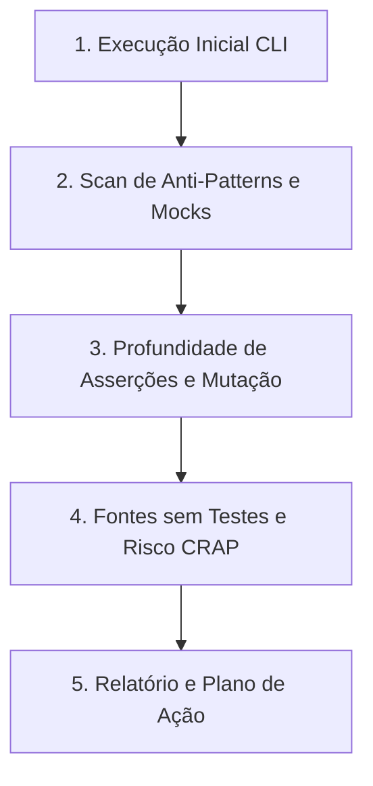

# Workflow: Auditoria de Testes (Audit Tests)

Workflow acionável para conduzir uma auditoria técnica completa e multi-dimensional da suíte de testes do Autogestor (`UnitTests`, `IntegrationTests` e `ArchitectureTests`), avaliando qualidade de asserções, anti-patterns, testes falsos-positivos, mutações não capturadas e manutenibilidade.

## Como Usar
Invoque este workflow utilizando o comando:
```bash
/audit-tests [caminho_ou_projeto_opcional]
```
Exemplos:
- `/audit-tests` (audita toda a suíte de testes da solução)
- `/audit-tests test/Autogestor.UnitTests` (foco exclusivo nos testes unitários de domínio e aplicação)
- `/audit-tests test/Autogestor.IntegrationTests` (foco nos testes de integração e persistência real)
- `/audit-tests test/Autogestor.ArchitectureTests` (foco nas regras de Clean Architecture com NetArchTest)

---

## Estrutura da Suíte do Projeto

| Projeto de Teste | Escopo | Tecnologias Principais | Regra de Governança |
| :--- | :--- | :--- | :--- |
| `Autogestor.UnitTests` | Domínio, use cases e orquestrações puras em memória | xUnit, NSubstitute | [.agents/rules/unit-testing-rules.md](../rules/unit-testing-rules.md) |
| `Autogestor.IntegrationTests` | Persistência real no PostgreSQL, repositórios, EF Core e Global Query Filters | xUnit, Testcontainers, EF Core | [.agents/rules/integration-testing-rules.md](../rules/integration-testing-rules.md) |
| `Autogestor.ArchitectureTests` | Integridade das fronteiras da Clean Architecture e design | xUnit, NetArchTest.eNhancedEdition | [.agents/rules/architecture-testing-rules.md](../rules/architecture-testing-rules.md) |

---

## Orquestração de Ferramentas, Subagentes e Skills



## Orquestração de Recursos por Plugin e Origem

### Plugin `dotnet-test`
- Subagente `test-quality-auditor`: Conduz o pipeline multi-skill de auditoria, sintetizando os achados de qualidade, profundidade e cobertura em um relatório consolidado.
- Skills `test-anti-patterns`, `assertion-quality`: Varredura de testes que geram falsa confiança e diagnóstico da profundidade e completude das asserções.
- Skills `test-gap-analysis`, `test-analysis-extensions`: Avaliação de resiliência a mutações, pontos cegos e análise avançada de frameworks de teste.
- Skills `find-untested-sources`, `coverage-analysis`, `crap-score`: Mapeamento de arquivos sem teste, análise de cobertura e pontuação de risco.

### Plugin `dotnet-experimental`
- Skills `exp-mock-usage-analysis`, `exp-test-maintainability`: Auditoria de dublês de teste, eliminação de setups mortos e redução de duplicação estrutural na suíte.

### Plugin `dotnet-test-migration`
- Skills `migrate-xunit-to-xunit-v3`, `migrate-vstest-to-mtp`: Adoção das melhores práticas modernas do ecossistema xUnit e otimização de execução.

### Plugin `dotnet-msbuild`
- Subagente `msbuild-code-review`: Auditoria de referências entre projetos de teste e assemblies de produção para garantia de limites arquiteturais.

### Submódulo `agent-skills`
- Skill `neon-postgres-branches`: Simulação e testes de integração em branches de banco isoladas.
- Servidor MCP `neon`: Validação de paridade estrutural entre contêineres de teste e o schema Lakebase Postgres.

---

## Passos de Execução da Auditoria

### Passo 1: Execução e Diagnóstico Inicial (CLI)
Executar a suíte de testes com prefixo `rtk` para estabelecer o estado atual:
```bash
rtk dotnet test Autogestor.slnx
```
Se o usuário especificou um projeto ou caminho alvo, filtrar:
```bash
rtk dotnet test [caminho_do_projeto]
```

### Passo 2: Varredura de Anti-Patterns e Qualidade das Asserções
- Executar a skill `test-anti-patterns` nos arquivos de teste do escopo.
- Executar a skill `assertion-quality` para verificar se os testes validam comportamento observável real e estados completos.
- Identificar testes redundantes ou desnecessários que não validam regras de negócio reais da aplicação.

### Passo 3: Auditoria de Mocks e Isolamento
- Em `Autogestor.UnitTests`, auditar dublês com `exp-mock-usage-analysis`, verificando utilidade real, estado inicial e ausência de setups mortos.
- Em `Autogestor.IntegrationTests`, assegurar isolamento contra dependências externas conforme [.agents/rules/integration-testing-rules.md](../rules/integration-testing-rules.md).

### Passo 4: Mapeamento de Fontes sem Testes e Pontos Cegos
- Executar a skill `find-untested-sources` para mapear arquivos de produção sem cobertura de teste correspondente.
- Executar `test-gap-analysis` nos fluxos críticos do escopo avaliado.

---

## Estrutura do Relatório de Auditoria

Ao concluir a auditoria, apresentar o resumo executivo:

```markdown
# 🧪 Relatório de Auditoria de Testes

## Resumo da Suíte
- **Projetos Auditados**: [Autogestor.UnitTests / IntegrationTests / ArchitectureTests]
- **Status Geral**: [🟢 Saudável | 🟡 Atenção | 🔴 Crítico]
- **Total de Testes Executados**: N testes (N aprovados, N falhas)

## Matriz de Qualidade por Dimensão
| Dimensão | Avaliação | Achados Principais |
| :--- | :---: | :--- |
| **Anti-Patterns** | [OK / Alerta] | Testes vazios, tautologias, swallowed exceptions |
| **Profundidade de Asserções** | [OK / Alerta] | Asserções de estado completo vs checagens superficiais |
| **Pontos Cegos (Mutação)** | [OK / Alerta] | Cenários de borda que não causariam falha de teste se quebrados |
| **Auditoria de Mocks** | [OK / Alerta] | Setups desnecessários ou mocks no lugar de banco real |
| **Fontes sem Cobertura** | [OK / Alerta] | Classes de domínio/aplicação desprovidas de testes |

## Achados Detalhados
> **[Severidade: Crítico/Importante/Sugestão] [Arquivo:Linha]** Título do Achado
> - **Problema**: Descrição factual da fraqueza do teste.
> - **Risco**: Impacto (ex: falso positivo em produção).
> - **Correção Recomendada**: Código de teste corrigido com asserções ricas.

## Plano de Ação Prioritário
1. [Ação imediata para testes críticos]
2. [Melhoria de asserções em use cases]
3. [Remoção de mocks redundantes / simplificação]
```
