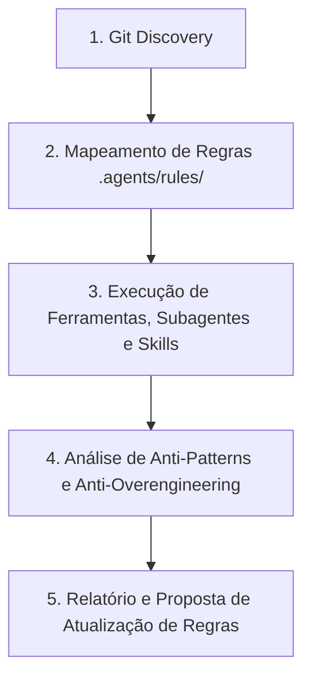

# Workflow: Daily Code Review & Quality Assurance

Workflow acionável para guiar o agente em uma revisão completa, aprofundada e factual de tudo o que foi produzido na sessão atual ou durante o dia de trabalho, garantindo conformidade arquitetural, performance, testabilidade, simplicidade e melhoria contínua da governança.

## Como Usar
Invoque este workflow utilizando o comando:
```bash
/code-review
```

---

## Fluxo de Execução do Review



---

## 1. Descoberta de Arquivos Alterados (Git Discovery)

O agente deve mapear todas as alterações realizadas utilizando comandos com prefixo `rtk`:

```bash
rtk git log --since="today 00:00" --name-only --oneline
rtk git status
rtk git diff --name-only
```

Agrupar os arquivos identificados por camadas do Autogestor:
- **Domínio**: `src/Autogestor.Domain/**`
- **Aplicação**: `src/Autogestor.Application/**`
- **Infraestrutura**: `src/Autogestor.Infrastructure/**`
- **Contratos**: `src/Autogestor.Contract/**`
- **API**: `src/Autogestor.Api/**`
- **UI (RCL)**: `src/Autogestor.UI/**`
- **Web (WASM)**: `src/Autogestor.Web/**`
- **ServiceDefaults**: `src/Autogestor.ServiceDefaults/**`
- **Banco Nativo**: `db/**`
- **Projetos / Build**: `**/*.csproj`, `Directory.Build.*`, `Directory.Packages.props`, `*.slnx`
- **Testes**: `test/Autogestor.UnitTests/**`, `test/Autogestor.IntegrationTests/**`, `test/Autogestor.ArchitectureTests/**`

---

## 2. Verificação de Conformidade com as Regras do Projeto

O agente deve carregar e avaliar os arquivos alterados contra a totalidade das regras aplicáveis em [.agents/rules/](../rules/), sem se limitar a subconjuntos pré-definidos:

1. **Multi-Tenancy e Segurança**: Consultar [.agents/rules/identity-multitenancy.md](../rules/identity-multitenancy.md).
2. **Padrões e Convenções C#**: Consultar [.agents/rules/csharp-conventions.md](../rules/csharp-conventions.md).
3. **Fronteiras Arquiteturais**: Consultar [.agents/rules/architecture.md](../rules/architecture.md).
4. **Contratos e Comunicação**: Consultar [.agents/rules/contracts-rules.md](../rules/contracts-rules.md).
5. **Regras Específicas por Camada**: Consultar os arquivos correspondentes em `.agents/rules/` para cada camada modificada (`domain`, `application`, `infrastructure`, `api`, `ui`, `web`, `service-defaults`, `database`, `unit-testing`, `integration-testing`, `architecture-testing`).

---

## 3. Orquestração de Ferramentas Especializadas

Para cada categoria de arquivos afetados, acionar as ferramentas, subagentes, skills e MCPs correspondentes, confiando no escopo analítico completo de cada recurso:

| Alvo / Camada | Recursos por Origem / Plugin | Objetivo Principal |
| :--- | :--- | :--- |
| **Código C# Geral (`.cs`)** | • **`dotnet-diag`**: subagente `optimizing-dotnet-performance`, skill `analyzing-dotnet-performance`<br>• **`dotnet-upgrade`**: skill `migrate-nullable-references` | Auditoria de anti-patterns de performance, concorrência, alocação de memória e nulabilidade estrita |
| **Contratos & gRPC (`Contract`)** | • **`dotnet-upgrade`**: skill `dotnet-aot-compat`<br>• **`dotnet-test`**: skill `assertion-quality`<br>• **`dotnet-diag`**: subagente `optimizing-dotnet-performance` | Compatibilidade com Native AOT, trimming, serialização leve e integridade de contratos |
| **Persistência / EF Core / SQL** | • **`dotnet-data`**: skill `optimizing-ef-core-queries`<br>• **`postgres-skills`**: skill `postgres-best-practices`<br>• **`agent-skills`**: skill `neon-postgres-egress-optimizer`, servidor MCP `neon` | Auditoria de modelagem de dados, eficiência de consultas, consumo de rede e integridade de schema |
| **Projetos e MSBuild (`.csproj`)** | • **`dotnet-msbuild`**: subagentes `msbuild-code-review`, `build-perf`, `msbuild`; skills `msbuild-antipatterns`, `directory-build-organization`; servidor MCP `binlog`<br>• **`dotnet-nuget`**: skill `convert-to-cpm` | Auditoria de integridade de compilação, centralização de pacotes CPM e anti-patterns MSBuild |
| **Testes Unitários e Integração** | • **`dotnet-test`**: subagente `test-quality-auditor`; skills `test-anti-patterns`, `assertion-quality`, `test-gap-analysis`, `test-analysis-extensions`<br>• **`dotnet-experimental`**: skill `exp-mock-usage-analysis` | Diagnóstico de profundidade de asserções, anti-patterns de teste, dublês e análise de mutação |
| **APIs e Observabilidade** | • **`dotnet-aspnetcore`**: skills `dotnet-webapi`, `configuring-opentelemetry-dotnet`, `minimal-api-file-upload` | Padrões de transporte HTTP/gRPC, rastreabilidade distribuída, métricas e endpoints seguros |
| **Frontend Blazor (UI e Web)** | • **`dotnet-blazor`**: skills `author-component`, `collect-user-input`, `coordinate-components`, `support-prerendering`, `use-js-interop` | Ciclo de vida de componentes, binding, validação, render modes e estado desacoplado |
| **Armazenamento e Cloud** | • **`agent-skills`**: skills `neon-object-storage`, `neon-functions` | Gestão eficiente de armazenamento de objetos e computação de apoio integrada ao Postgres |
| **Todo o Código Produzido** | • **`ponytail`**: skills `ponytail-review`, `ponytail-audit`, `ponytail-gain` | Auditoria de minimalismo, eliminação de complexidade acidental e anti-overengineering |

---

## 4. Estrutura do Relatório de Fechamento

Ao concluir a análise, o agente deve apresentar o relatório estruturado:

### 📋 1. Resumo do Trabalho da Sessão
- Lista concisa de features, correções ou refatorações desenvolvidas.
- Principais arquivos criados ou alterados agrupados por camada.

### ✅ 2. Pontos Positivos
- Destaques de boa arquitetura, conformidade com DDD, asserções de testes rigorosas e código limpo.

### ⚠️ 3. Oportunidades de Melhoria e Riscos Identificados (Acionáveis)

Auditar o código de forma neutra e orientada aos fatos, categorizando cada achado:

#### Classificação de Severidade
- 🚨 **Crítico**: Riscos de segurança, quebra de isolamento multi-tenant, corrupção de dados, falhas de compilação ou violação grave de fronteiras arquiteturais.
- ⚠️ **Importante**: Ineficiências de performance, gargalos de I/O, falhas de propagação de cancelamento, ausência de validação ou lacunas em testes.
- 💡 **Sugestão**: Complexidade acidental (over-engineering), código morto, oportunidades de simplificação ou alinhamento fino de estilo.

#### Dimensões Obrigatórias de Avaliação
1. **Segurança & Multi-Tenancy**: Garantia do isolamento absoluto de dados entre clientes, consistência de contexto e autorização operacional.
2. **Performance & Recursos**: Eficiência no uso de memória, concorrência, operações de I/O assíncronas e eficiência em persistência.
3. **Conformidade Arquitetural**: Aderência rigorosa às fronteiras da Clean Architecture, modelagem de domínio, contratos e convenções de código.
4. **Qualidade e Cobertura de Testes**: Profundidade das asserções, cobertura de cenários reais de negócio e confiabilidade da suíte.
5. **Simplicidade & Manutenibilidade**: Identificação de abstrações prematuras, camadas desnecessárias ou código defensivo redundante.

#### Formato Padronizado de Cada Achado
> **[Severidade] [Dimensão]** Título objetivo do achado
> - **Localização**: `caminho/do/arquivo:linha`
> - **Comportamento Atual**: Descrição factual do que foi implementado.
> - **Impacto / Risco Técnico**: Explicação do impacto em produção, manutenibilidade ou segurança.
> - **Ação Recomendada**: O que deve ser ajustado, acompanhado do trecho de código/diff sugerido.

### 💡 4. Sugestão de Atualização de Regras / Documentação (.agents)
- Se durante o review for identificado:
  - Um novo padrão ou diretriz adotada na solução que ainda **não está documentada** nos arquivos de governança.
  - Uma ambiguidade entre o que as regras pedem e o que a arquitetura do projeto necessita.
- Apresentar a proposta de texto para inclusão ou edição no arquivo correspondente em `.agents/rules/`.
- **Diretriz de Agnosticismo (Conformidade com AGENTS.md)**: As propostas de alteração documental devem ser **estritamente conceituais e agnósticas de código concreto**. É expressamente proibido sugerir textos contendo menções a classes pontuais, métodos, propriedades, variáveis ou trechos de código específicos. As propostas devem expressar exclusivamente diretrizes macro, fronteiras arquiteturais, semânticas de responsabilidade por camada e invariantes de governança, prevenindo o viés de confirmação ou visão de túnel (*tunnel vision*).

